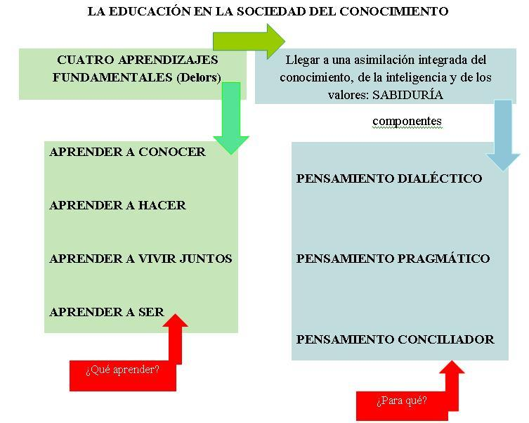

# 1.1. Concepto de aprendizaje

 

**... "Nadie puede hoy esperar que el acervo inicial de conocimientos constituido en la juventud le baste para toda la vida, pues la rápida evolución del mundo exige una actualización permanente del saber (…) la educación, debido a la misión que se le ha asignado y a las múltiples formas que puede adoptar, abarca desde la infancia hasta el final de la vida ( ... ) la educación debe estructurarse en torno a **cuatro aprendizajes fundamentales**, que en el transcurso de la vida serán para cada persona, en cierto sentido, los pilares del conocimiento: **aprender a conocer**, es decir, adquirir los elementos de la comprensión; **aprender a hacer**, para poder influir sobre el propio entorno; **aprender a vivir juntos**, para participar y cooperar con los demás en todas las actividades humanas; **aprender a ser**, proceso fundamental que recoge elementos de los tres anteriores"**

**(J. Delors, La educación a lo largo de la vida, Informe a la UNESCO de la Comisión Internacional sobre educación para el siglo XXI)**

 

Los cuatro pilares básicos de la educación propuestos por la Comisión Internacional, presidida por **J. Delors** en su **Informe a la UNESCO sobre la educación para el siglo XXI **:

- **Aprender a conocer**. Aprender para conocer supone, en primer término aprender a aprender ejercitando la atención, la memoria y el pensamiento, combinando una cultura general suficientemente amplia con la posibilidad de profundizar los conocimientos en un pequeño número de materias. Aprender a aprender para poder aprovechar las posibilidades que ofrece la educación a lo largo de la vida.
- **Aprender a hacer.**Aprender a hacer en el marco de las distintas experiencias sociales o de trabajo que se ofrecen a los jóvenes y adultos, bien espontáneamente a causa del contexto social o nacional, bien formalmente gracias al desarrollo de la enseñanza.
- No es una mera transmisión de prácticas concretas, de pericia material, sino que exige un comportamiento social, aptitud para trabajar en equipo, capacidad de iniciativa y asumir riesgos a fin de adquirir no sólo una cualificación profesional sino, más generalmente, una competencia que capacite al individuo para hacer frente a gran número de situaciones.
- **Aprender a vivir juntos****. **Desarrollando la comprensión del otro y la percepción de las formas de interdependencia –realizar proyectos comunes y prepararse para tratar los conflictos- respetando los valores de pluralismo, comprensión mutua y paz.
- **Aprender a ser****.** Para que florezca mejor la propia personalidad y se esté en condiciones de obrar con creciente capacidad de autonomía, de juicio y de responsabilidad personal. Con tal fin, no menospreciar en la educación ninguna de las posibilidades de cada individuo: memoria, razonamiento, sentido estético, capacidades físicas, aptitud para comunicar... Implica un proceso dialéctico que comienza por el conocimiento de si mismo y se abre después a las relaciones con los demás. En este sentido, la educación es un viaje interior, cuyas etapas corresponden a las de la maduración de la personalidad.

**1. ****Concepto de aprendizaje**

El aprendizaje es un proceso sumamente complejo en el que intervienen y confluyen muchas variables; la eficacia del proceso va a depender en gran medida de que el planificador y el docente tengan en cuenta y controlen estas variables; de aquí la importancia del conocimiento de las mismas y las teorías científicas donde fundamentar su actividad.

En el comportamiento humano se distinguen **dos grandes tipos de conducta**: **innata **(no aprendida) y **adquirida **(aprendida). La mayor parte de la actividad del hombre es resultado del aprendizaje (aprende a usar instrumentos, descubre nuevos, aprende a pensar, aprende actitudes... ).

Existen múltiples y variadas teorías psicológicas que tienen en común la concepción básica de que los procesos de aprendizaje juegan un papel central en el desarrollo del ser humano y, aunque resulta imposible encontrar una única definición de aprendizaje que sea aceptada por todos los psicólogos de este campo, se puede afirmar que los psicólogos que estudian el aprendizaje se interesan por **procesos de cambio que ocurren como resultado de la experiencia.**

El aprendizaje es el proceso que produce un **cambio** relativamente **permanente** en el comportamiento de un organismo que refleja una adquisición de conocimientos o habilidades **a través de práctica o de la experiencia** obtenida por el estudio, la instrucción, la observación.

a) **Es un proceso que produce un cambio**.  Para los conductistas es un cambio de la conducta externa, observable; para los cognitivos es un cambio interno, en las capacidades y disposiciones del sujeto.

b) **Se adquiere como resultado de la experiencia o la práctica**; se excluyen del aprendizaje los cambios que son resultado del desarrollo físico, los que son resultado de la maduración y los que son resultado de la fatiga, de las drogas o de las adaptaciones sensoriales.  El problema se plantea con la maduración esta es consecuencia de la edad y el aprendizaje interactúa pero son dos cosas distintas aunque a veces es difícil  distinguir si el cambio es consecuencia de la maduración o del aprendizaje; muchas conductas se desarrollan por la acción recíproca de ambos, ej. El lenguaje o la marcha.

c) **Los efectos del aprendizaje tienen que ser relativamente permanentes**. Que persista un tiempo relativamente largo en la vida del sujeto.

## Actividad del foro

**Intervención reflexiva en el foro**

Reflexiona y expresa tu opinión en el fro acerca de cuál o cuáles serían los pilares fundamentales para el aprendizaje adulto. Explica por qué.
