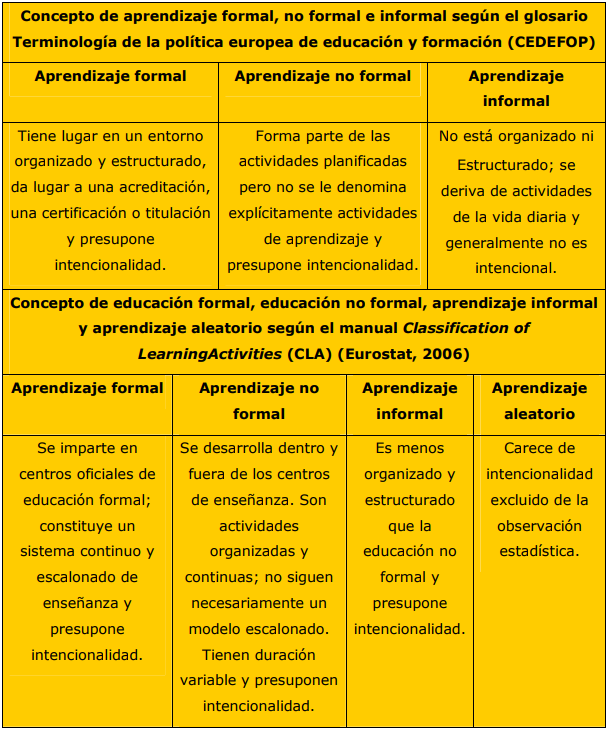

# 1.3. Educación formal, no formal e informal.

### 3.1. Educación formal

Es la educación estructurada institucionalmente, con un programa de estudio planificado y dirigido al reconocimiento formal del logro de objetivos educativos, tales como créditos, diplomas, grados o titulaciones. Se podría relacionar con el término de formación reglada. Es importante reconocer que el termino “educación formal de personas adultas” incluye una amplia gama de aprendizajes que tienen lugar en entornos organizados y estructurados (un centro educativo o formativo, o bien en el centro de trabajo). Además, presupone intencionalidad por parte del que aprende. Por regla general, da lugar a una acreditación y una certificación o titulación.

"Si la escuela ha de cumplir la noble misión que la tiene confiada nuestro siglo... no puede encerrarse entre cuatro paredes, tiene que actuar al aire libre, tiene que aspirar la vida a raudales.” Joaquín Costa.

### 3.2. Educación no formal

Es una educación estructurada cuya finalidad no es la obtención de un título o reconocimiento oficial (educación no reglada).

### 3.3. Educación informal

Es un proceso educativo no organizado que transcurre a lo largo de la vida de una persona, proveniente de las influencias educativas de la vida diaria y del medio ambiente. Es también una educación no reglada, se trata del aprendizaje resultante de actividades cotidianas relacionadas con el trabajo, la vida familiar o el ocio. Los aprendizajes informales carecen, por regla general, de intencionalidad por parte del que aprende.

>**tip**
>## Para saber más
>
>La UE ha acordado el reconocimiento de la educación “informal” y “no formal”. Entra en el siguiente enlace para descubrir cómo y cuándo se desarrollará este proceso.
>
>- [http://www.larazon.es/detalle_hemeroteca/noticias/LA_RAZON_ ](http://www.larazon.es/detalle_hemeroteca/noticias/LA_RAZON_505194/9249-la-ue-acuerda-el-reconocimiento-de-la-educacion-informal-y-no-formal#.UYKcZXmf-a8)
>
>

 
