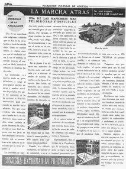

# 2.1. Evolución histórica

### 1.1. La educación de educación de personas en las sociedades tradicionales anteriores al siglo XIX

La educación de personas adultas en sentido estricto **nace en el siglo XIX** cuando los estados adquieren protagonismo en la organización y gestión del sistema educativo.

Antiguamente, en el **periodo clásico griego**, la “paideia” es una preparación para la vida activa. La “utopía platónica” de la educación aspira a producir el hombre culto. Cuatro siglos antes de nuestra era los sofistas inauguran las bases de la educación: el uso correcto del lenguaje (gramática), eficaz (dialéctica) y decoroso (retórica), no hay grados ni edades; en torno a Sócrates o a Protágoras deambulan por las escuelas atenienses adolescentes y adultos sin distinción.

En **Roma**, las Instituciones Oratorias de Quintiliano están dirigidas claramente a una población adulta.

En la **Edad Media** la organización gremial y las hermandades organizan una formación que no prima las edades tempranas. En las universidades medievales, si bien asistían jóvenes y adolescentes, lo hacían junto a una mayoría de personas adultas.

En los **siglos XVI y XVII** el aprendizaje de la lectura de libros impresos sirve, sobre todo, a fines catequéticos.

### 1.2. La educación de adultos en España en el XIX

En los albores del siglo XIX, el sistema escolar estatal está dirigido a los niños y la primera aproximación al concepto de educación de adultos trata de extender la escolarización a los adultos que no han pasado por el sistema escolar. La primera vez que se menciona la educación de adultos en España es en el **Reglamento de Instrucción Pública** de 1821.

En un principio, tiene una dependencia cercana a Diputaciones y municipios, como lo demuestra un ambicioso proyecto de 1842 en la provincia de Zamora dirigido a las clases más desfavorecidas.

En 1857 se publica** la Ley Moyano** que ordena al gobierno el fomento de **lecciones de noche o de domingo para adultos** cuya instrucción haya sido descuidada o que quieran adelantar en conocimientos. Dicha ley, sin embargo, no encuentra medios y se limita animar a las Comisiones Provinciales y a los municipios a promover las medidas necesarias para el mantenimiento de las lecciones de adultos.

Como **iniciativa no estatal** fue efímera la etapa del **Ateneo** (1820-24) cercano a los intereses de una burguesía ilustrada y se limitó, en un principio, a los centros recreativos para obreros y acciones puntuales del clero rural. Las aportaciones más importantes vienen de la **Institución libre de Enseñanza**. En 1900, en Oviedo, nace la primera **Universidad Popular**, con el fin de acercar y difundir la cultura al obrero adulto, también incluía cursos para mujeres.

### 1.3. La iniciativa estatal en el siglo XX

**a) Principios del siglo XX**

En **1900 el analfabetismo en España es de un 63,79 por 100** y el recién creado Ministerio de Instrucción Pública empieza por promulgar numerosas disposiciones para hacer efectivas las previsiones de la Ley Moyano.

Un lustro más adelante se marca un hito importante en la educación de personas adultas y, por primera vez, se habla de una **campaña contra el analfabetismo**, cuyo articulado precisa que los maestros encargados recibirán una gratificación, tendrá una duración de cinco meses con enseñanzas prácticas y se procurará que colaboren personas de notoria cultura como médicos, farmacéuticos o agrónomos. La aplicación fue prácticamente nula.

En 1922 se crea la Comisión Central contra el analfabetismo y las Misiones Pedagógicas; se formula un plan de trabajo que empezará por las provincias con mayores tasas de analfabetos.

**b) La Segunda República**

Con la llegada de la **II República**, las bienintencionadas normativas sobre educación de adultos se ven frenadas por los acontecimientos políticos. Se crea el Patronato de las **Misiones Pedagógicas** y se impulsa la creación de bibliotecas escolares. La O.M. de 1932 organiza tres grupos en las enseñanzas de adultos:

1. *Para alumnos analfabetos, enseñanza del idioma y nociones de Geografía, Historia y Matemáticas.*
1. *Ampliación del programa de la escuela para quienes ya estén iniciados en las diferentes ramas que aquel comprende.*
1. *Clases especiales sobre temas de aplicación a las principales actividades, oficios u ocupaciones predominantes en la localidad o región.*

>**tip**
>## Para saber más
>
>A través de estos tres documentos imprescindibles  puedes acercarte al conocimiento de lo representó el patronato de las **Misiones Pedagógicas** en el periodo 1931-36.
>
>Las Misiones Pedagógicas están consideradas como la realización más generosa de la II Republica. En su labor distribuyeron más de 5000 bibliotecas y llevaron cultura y diversión a los lugares más alejados de España. Este documental recupera, a través de la palabra de algunos misioneros y el recuerdo de los que por aquel entonces eran niños, su labor altruista.
>
>- [http://www.youtube.com/watch?v=tYmfcvXqUBM ](http://www.youtube.com/watch?v=tYmfcvXqUBM).
>
>Extracto de vídeo sobre la labor de las Misiones Pedagógicas durante la II República.
>
>- [http://www.youtube.com/watch?v=5rmWEc_Iqrg ](http://www.youtube.com/watch?v=5rmWEc_Iqrg)
>
>José Luis Melero, Miguel Mena y Víctor Juan recuerdan el octogésimo aniversario de la proclamación de la II República escuchando unas excepcionales jotas republicanas cantadas por José Oto. Además analizan la repercusión del Patronato de Misiones Pedagógicas en Aragón comentando la fotografía de las Misiones Pedagógicas en Bonansa (1932), las bibliotecas, el coro de las misiones y el museo del pueblo.
>
>- [http://tertuliasomos.blogspot.com.es/2011/04/somos-tercera-tertulia.html](http://tertuliasomos.blogspot.com.es/2011/04/somos-tercera-tertulia.html)

**c) El Franquismo**

Tras la guerra civil, durante el **franquismo** la iniciativa se lleva por el estado, las organizaciones paraestatales del Movimiento nacional y la acción de la Iglesia. Se llevan a cabo dos hechos fundamentales: la eficaz lucha contra el analfabetismo y el enmarque de la educación de personas adultas en la estrategia de Educación Permanente, sobre todo a partir de 1960, por influencia de organismos internacionales como la UNESCO. Se declaran obligatorias las clases nocturnas y en 1950 nace la Junta Nacional contra el Analfabetismo y cuatro años más tarde la enseñanza de adultos se organizó en varias modalidades:

1. Alfabetización.
1. Enseñanzas suplementarias para las personas con conocimientos básicos adquiridos.
1. Ampliación cultural.
1. Enseñanzas profesionales. (Con este fin se crea, en 1964, el Programa de Formación Profesional Obrera –PPO-, iniciativa de carácter ocupacional).

En 1963 se inicia la Campaña Nacional de Alfabetización y de promoción cultural de adultos. Tenía tres niveles: Central, Provincial y Local (Junta municipal, maestros tutores, maestros alfabetizadores, voluntarios y comisiones examinadoras). Se crean instrumentos como cartillas de lectura y escritura, un periódico quincenal “ALBA” para neolectores y una colección de 52 lecciones de Lengua, matemáticas, historia, etc., grabadas en discos. Se recurrió a emisiones radiofónicas e incluso a una emisión de T.V. Española: “imágenes para saber”.

 

**d) Década de los años 70 a los 80**

En 1970, la Ley general de Educación supone un importante impulso a la Educación de Adultos, establece que en centros ordinarios o específicos podrán seguirse estudios de educación reglada, perfeccionamiento, actualización y readaptación profesional, así como de extensión cultural.

Para cumplir las previsiones de la Ley, en 1973 se crea el Programa de Educación Permanente de Adultos. Las orientaciones pedagógicas para la Educación Permanente de Adultos en el nivel educativo de Educación General Básica (EGB) establecían tres ciclos de referencia, a los tres ciclos de que constaba el nivel educativo de idéntico nombre.

 Otra característica de la década 1970-80 fue el impulso de la enseñanza a distancia. Se crearon el Centro Nacional de Educación Básica a Distancia (CENEBAD) y el Instituto Nacional de Bachillerato a Distancia (INBAD).

**e) Década de los años 80 a los 90**

En el decenio 1980-90 se produjo un aumento cualitativo y cuantitativo de la oferta de Educación de Personas Adultas, derivado de una demanda creciente. Por una parte, se ampliaron las ofertas de Formación Profesional y se revisó el modelo de los centros de Educación de personas adultas, de forma que, además de impartir enseñanzas regladas, fuesen impulsores y dinamizadores de una oferta educativa más amplia.

Con la promulgación en 1990 de la Ley Orgánica de Ordenación General del Sistema Educativo (LOGSE) se crea un nuevo marco legal para la EPA en España. Se desarrolla una concepción de la educación basada en la idea de aprendizaje a lo largo de toda la vida y reconoce la educación permanente como principio básico del sistema educativo.

### 1.4. Del año 2000 a la actualidad:

En el año 2002 se aprobó la Ley Orgánica de Calidad de la Educación (LOCE), su título tercero se dedica a la enseñanza para las Personas Adultas dentro del marco de la educación permanente. El objetivo consiste en dotar a los adultos de una formación que les permita acceder a los distintos niveles del sistema educativo, mejorar su cualificación profesional, así como desarrollar su capacidad de participación en la vida social, cultural, política y económica.

Siguió la Ley Orgánica 2/2006, de 3 de mayo, de Educación (LOE). El título primero de esta Ley se centra en la EPA, dándole un tratamiento similar al del resto de enseñanzas en las que se organiza el sistema educativo. La educación de adultos en la LOE tiene como finalidad el ofrecer a los mayores de dieciocho años la posibilidad de adquirir, completar o ampliar conocimientos y aptitudes para su desarrollo personal y profesional.

>**info**
>## Importante
>
>El artículo de El País [“De la alfabetización a la enseñanza permanente”](http://elpais.com/diario/1978/05/27/sociedad/265068006_850215.html) hace un recorrido histórico que analiza aspectos importantes de la educación de adultos en España. No dejes de leerlo, te ayudará en la resolución de la tarea.
