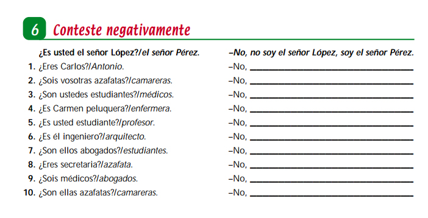
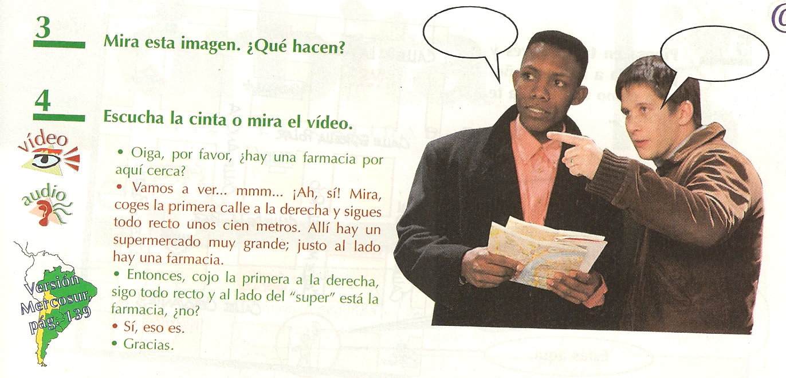
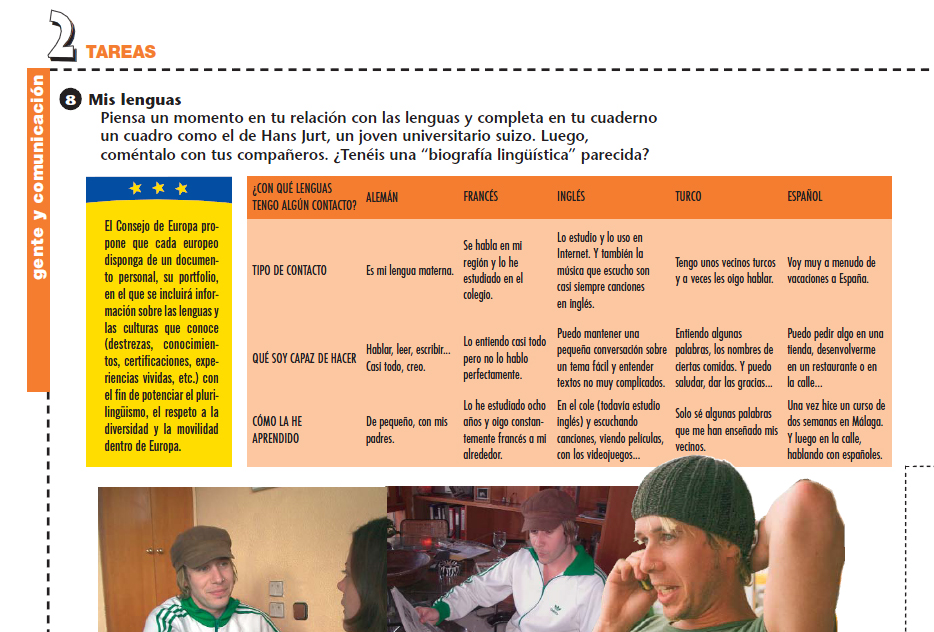

# 2.2. ¿Cómo se enseña una nueva lengua?

Los métodos utilizados en los contextos formativos para enseñar lenguas extranjeras han variado a lo largo del tiempo. Es conveniente conocerlos para ser conscientes de lo que hacemos en el aula y valorar qué metodología se ajusta mejor a las necesidades de nuestros alumnos.

**2.1. Los métodos estructuralistas**

Los métodos estructuralistas entendían el aprendizaje de una nueva lengua como un camino recto en el que el alumno iba sumando uno tras otro los componentes del sistema lingüístico. Tenían como objetivo la enseñanza de estructuras que se introducían gradualmente según se entendía su nivel de dificultad. Las estructuras aparecían descontextualizadas y se priorizaba un conocimiento correcto de la gramática. La gramática se estudiaba por partes, concediendo gran importancia a la morfología (especialmente a los listados de formas verbales) y a la frase como unidad superior. El error era visto como algo negativo que se debía prevenir y evitar.

El problema de estos métodos era que partían de una idea equivocada sobre cómo se adquiere una nueva lengua.  Confundían el uso de la lengua con el conocimiento de su sistema. No tenían en cuenta ni el discurso, ni el contexto. Al tratar de evitar el error se impedía además la comunicación. Se trata de métodos que, por tanto, no son adecuados para la enseñanza de español para inmigrantes, puesto que nuestro principal objetivo es que los alumnos puedan adquirir un nivel de comunicación satisfactorio y puedan interactuar significativamente con su entorno.

A pesar de ser métodos descartados en la enseñanza de lenguas extranjeras, hoy en día, todavía podemos observar que se siguen utilizando, especialmente cuando el docente no tiene la formación adecuada. Son métodos que resultan bastantes sencillos de aplicar porque transmiten seguridad al profesorado al tener una materia que impartir organizada, estructurada, ordenada… además, el docente también puede encontrarse con alumnos satisfechos con su forma de plantear la clase. Suele tratarse de alumnos que tienen miedo al error, o no conceden importancia a la comunicación oral, o bien tienen un buen dominio oral pero asisten a las clases para resolver dudas gramaticales. Su aceptación también puede deberse a sus experiencias previas; por ejemplo: si en sus países de origen les enseñaron otras lenguas extranjeras desde este mismo planteamiento, pueden considerar que también así deben aprender el español.

**Observa esta actividad:** **¿Se han contextualizado los diálogos? ¿Responden a un uso real del español?**

 

**2.2. El enfoque comunicativo**

El enfoque comunicativo se basa en el principio de que aprender una lengua es aprender a comunicarse en ella. Su objetivo es que los hablantes sean competentes en su uso. Desde esta perspectiva, **el contexto** será fundamental para usar la lengua de forma adecuada y la comunicación se logrará a través de elementos lingüísticos y extralingüísticos. En consecuencia, disciplinas como la pragmática o la sociolingüística adquieren especial relevancia.

Estos principios se concretan llevando al aula situaciones comunicativas reales, similares a las situaciones en las que deben desenvolverse los alumnos; es decir, se trata de crear un contexto para usar la lengua, valorando lo que es correcto o no, lo que es oportuno o no,  y lo que es adecuado o no en esa situación. El docente, además, debe favorecer el uso de estrategias comunicativas para que los alumnos puedan desenvolverse en cada situación, estrategias que les permitan superar dificultades y limitaciones.

El error transitorio es visto como natural en el proceso, como índice del nivel de interlengua del alumno y como necesario para progresar.  De esta manera, los errores van evolucionando, unos se superan y surgen otros que nos muestran los avances y el nivel de complejidad de la lengua que ya es capaz de utilizar el hablante. Cada error se trabaja en el aula en el momento adecuado, cuando el alumno está preparado, pero nunca se trabajan demasiados a la vez, pues además de no ser efectivo, podría suponer un bloqueo de la motivación del alumno y dificultar su progresión.

El enfoque comunicativo no proporciona un método único, coherente, ordenado, estructurado e independiente del grupo meta. El programa se construye teniendo en cuenta los conocimientos previos, intereses y necesidades de los alumnos.  Como resultado, la implementación de este enfoque plantea problemas cuando su conocimiento por parte del docente es superficial y poco desarrollado. Por ejemplo, si se sigue un manual de E/LE, las situaciones comunicativas que se llevan al aula pueden no ser del interés del grupo; o, al ser simulaciones  ficticias, puede resultar difícil implicar a los alumnos, especialmente a los que no tienen experiencias escolares previas similares y no encuentran sentido a la actividad; o bien la enseñanza de la gramática se ignora o relega, sin saber muy bien cómo trabajarla y, ante las demandas de los alumnos, se recurre a los enfoques tradicionales y estructuralistas para su enseñanza.

**Observa estas actividades**: **¿Se han contextualizado los diálogos? ¿Responden a un uso real del español?**

**2.3. La enseñanza mediante tareas y proyectos**

La enseñanza mediante tareas y proyectos surge como una propuesta educativa con una fundamentación basada principalmente en las nuevas teorías humanistas sobre el aprendizaje. Es decir, se traslada el foco de la enseñanza al aprendizaje, de manera que conceptos como **aprendizaje significativo, aprendizaje por descubrimiento, aprendizaje colaborativo,  implicación del alumno en su proceso de aprendizaje, construcción guiada del conocimiento**, etc. subyacen a esta propuesta.

Además, este enfoque responde a las aportaciones que la investigación ha realizado sobre la adquisición de segundas lenguas, quedando demostrado que las lenguas no se aprenden de forma lineal. Por lo tanto, sirve de muy poco presentar los contenidos lingüísticos en un orden preestablecido. Esta linealidad nunca iría de la mano de la interlengua del alumno, cuyo proceso de construcción es más complejo y no consiste en ir sumando estructuras nuevas, una detrás de otra.

Algunos autores sitúan la enseñanza mediante tareas y proyectos dentro del enfoque comunicativo. Para otros, se trata de una evolución que consiste en un nuevo enfoque, los modelos procesuales.

En cualquier caso, las tareas se caracterizan por los siguientes aspectos:

- Dotan de unidad y sentido a lo que se dice y hace en el aula.
- Organizan todos los elementos del currículum: objetivos, contenidos, destrezas, evaluación…
- Implican un uso real de la lengua en el aula, al utilizarla para “hacer algo” juntos.
- Surgen dentro del grupo, de acuerdo a sus necesidades e intereses.
- Son elásticas y flexibles, pueden resolverse en una clase o necesitar varias, pueden enlazarse y generar nuevas tareas derivadas, etc.
- Inciden en el proceso más que en el resultado final.
- Permiten la recurrencia de los contenidos (no la linealidad), al volver en futuras tareas sobre aquellos que son más necesarios para cada grupo y para cada persona.

Como podemos observar, las tareas permiten los requisitos que estipulaba Krashen como idóneos para que tuviera lugar la adquisición, por lo que resultarían adecuadas para todos los alumnos.

Algunos ejemplos de tareas pueden ser: *escribir un mensaje por correo electrónico, debatir sobre un tema de actualidad, escribir un anuncio buscando piso, escuchar una canción, solicitar una cita médica, trazar un itinerario en un mapa, hacer el currículum vitae, etc.*

Por su parte, los proyectos se diferencian de las tareas en que requieren mayor duración en el tiempo y son interdisciplinares, es decir, tienen la capacidad de globalizar varias materias, por ello se adecuan a una formación integral de la persona. Los proyectos suelen conformarse por una sucesión de tareas en torno a un mismo tema, en el que se profundiza. Son especialmente utilizados en etapas como la educación infantil y se muestran aconsejables en la educación de adultos. No obstante, requieren de cierta estabilidad del grupo meta para afianzar los objetivos.

Tanto si trabajamos por tareas como por proyectos, los alumnos tendrán que superar retos comunicativos y adquirir nuevos aprendizajes que serán significativos en la medida en que sean necesarios para resolver las tareas y conecten con sus conocimientos previos. El docente es el encargado de orientar el proceso. En el transcurso de resolución de las tareas, se detendrá para introducir los contenidos necesarios, realizar las explicaciones gramaticales oportunas, reflexionar con los alumnos sobre los aprendizajes realizados, ayudar a los alumnos a que induzcan normas a partir del discurso generado en el aula, etc. son paradas que constituyen lo que se denominan “tareas intermedias”, “tareas posibilitadoras”, “tareas de aprendizaje”…

En conclusión, las tareas y los proyectos aportan un eje real que guía la programación y sobre el que se construyen aprendizajes lingüísticos y extralingüísticos significativos. Las conversaciones y los textos que se generen en clase para resolver las tareas tendrán un alto grado de imprevisibilidad, no se tratará de un discurso prefijado que haya que repetir e imitar, sino que serán producciones creativas, reales. La gramática cobrará aquí especial relevancia, pero no será un elemento aislado o descontextualizado, estará integrada en la propia tarea siendo esta la que reclamará su presencia en el momento oportuno y necesario. Todos los contenidos de la programación se encontrarán al servicio de la tarea y no a la inversa; es decir, serán las necesidades comunicativas implícitas en la tarea las que exigirán y pondrán en relación los contenidos sobre los que se podrá volver en otras ocasiones. De esta manera, cada tarea será diferente y supondrá nuevos retos para los alumnos, pero los contenidos lingüísticos girarán en una espiral recurrente, necesaria para adquirir una nueva lengua.

**Observa esta actividad**: *¿Cómo es el diálogo que genera la actividad? ¿En qué se diferencia de los diálogos que hemos visto anteriormente?*

