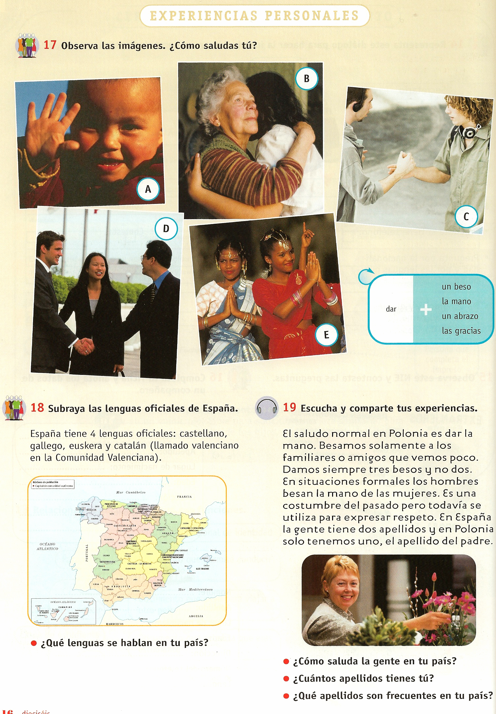

# 2.3. ¿Cómo se gestiona un grupo de enseñanza del español?

Partiendo de la evidencia de que todo grupo humano es diverso, la heterogeneidad suele ser una de las características más atribuidas a los grupos de inmigrantes adultos. No es extraño. Estos grupos no sólo cuentan con la diversidad de cualquier grupo de adultos sino que además se les suman otros rasgos más específicos. Como resultado nos encontramos grupos heterogéneos en cuanto a edad, personalidad, intereses, motivación, actitud, estrategias de aprendizaje, expectativas, procedencias, culturas, lenguas maternas, niveles de escolaridad, niveles de competencia en español…

Frente a una organización escolar que se nos muestra claramente homogeneizadora, en la actualidad, la investigación educativa valora las ventajas que la diversidad puede proporcionar al desarrollo de un grupo, especialmente en lo que se refiere a las enseñanzas de lenguas. Entre las ventajas se destacan: la posibilidad de apoyo entre alumnos de diferentes niveles en la negociación del significado; el andamiaje colectivo o aprendizaje en cooperación; la riqueza de experiencias que los alumnos pueden intercambiar, favoreciendo su entendimiento; la necesaria colaboración de los alumnos para el buen funcionamiento de la clase; y el estímulo que supone para la práctica profesional.

La mezcla de niveles puede convertirse en un elemento negativo, que dificulte la programación del educador y sus expectativas, o en un elemento enriquecedor que favorezca el aprendizaje. A simple vista no parece fácil, pero es una cuestión que va a depender en buena medida de nuestra actitud, de cómo organicemos el aula y de cómo marquemos las prioridades. Para una gestión positiva de los grupos, te formulamos algunas sugerencias:

1. **Conoce a las personas del grupo**: Todos los datos que podamos detectar son importantes; por ejemplo, nacionalidades, trayectoria, conocimiento de otros idiomas, conocimientos previos del español, formación, escolarización previa, intereses...

**2. Realiza programaciones a corto plazo:** Si tu grupo es muy inestable, programa cada sesión de forma autónoma, aunque te plantees objetivos a largo plazo. Sé flexible con las programaciones, recuerda que la programación debe ser procesual, construyéndose día a día con el grupo.

3. **Plantea una única tarea para todos los participantes:** Trabajar por tareas permite cohesionar al grupo, al dirigirse hacia un mismo propósito que es compartido, favorece por tanto el trabajo en equipo y la unidad de objetivos…  Al mismo tiempo, es una metodología flexible que posibilita la atención de todas las necesidades, pues en la secuenciación de la tarea y en la distribución de tareas intermedias es posible estipular objetivos individuales. La propia acción y desarrollo de la tarea lo requiere, porque los pone en evidencia y ayuda al alumno a hacerse consciente de ellos. Es decir, la tarea final debe ser común para todos, es en algunas tareas intermedias en las que puedes solicitar diferentes niveles de trabajo.

**4. Forma pequeños grupos aplicando distintos criterios:** Son varios los estudios que confirman la utilidad del trabajo por parejas o en pequeños grupos para la práctica de la lengua y su aprendizaje. Entre sus ventajas destacan la reducción de la ansiedad, el aumento de la confianza, de la motivación y de la autonomía, el aprendizaje de la lengua meta… para ello, no organices siempre los grupos de trabajo por niveles. Recuerda que una persona aprende mejor cuando es capaz de transmitirlo a otra persona. Intenta favorecer la negociación del significado, el apoyo entre compañeros y el andamiaje.

**5. Trabaja todas las destrezas, pero sobre todo la interacción oral**: Piensa que la necesidad de comunicarse oralmente es prioritaria y necesaria para todos los alumnos. Para desarrollarla, no necesitamos el texto escrito sino otro tipo de recursos como fotos, audiciones, vídeos,  mapas, Internet... de esta forma conseguirás que todo el grupo se encuentre en igualdad de condiciones y las personas no alfabetizadas puedan participar sin dificultades añadidas.

**6. Respeta las fases de trabajo de una tarea:** Casi todas las tareas necesitan una fase previa, de introducción al tema, en la que se debe fomentar la anticipación, la deducción, la detección de conocimientos previos, etc. La segunda fase es la de trabajo, en la que se pueden realizar diferentes tareas intermedias y resolver la tarea final. Por último, está la fase posterior de explotación y de valoración. Es necesario reflexionar con el grupo sobre el proceso desarrollado para que los alumnos sean conscientes de los aprendizajes realizados más allá de lo concreto de la tarea. De esta manera, podrán valorar el enfoque metodológico utilizado y encontrarán sentido a lo que se hace en el aula. La reflexión final permitirá además negociar en el grupo otras tareas de su interés.

**7. Trabaja los errores como parte del proceso de aprendizaje**: No corrijas a los alumnos mientras hablan, deja que se expresen sin miedo y observa los errores. Después puedes trabajar alguno, no todos, utilizando distintas estrategias para que sean los mismos participantes los que puedan detectarlos. Recuerda que los errores transitorios nos facilitan datos sobre el nivel del alumno y forman parte natural del proceso de adquisición de la lengua.

**8. Favorece la comunicación y la colaboración del grupo en el funcionamiento de la clase**: Provoca situaciones comunicativas reales,  motivadoras y abiertas, que inciten a la participación de los alumnos y a su libre expresión y deja que para ello utilicen diferentes lenguas si así lo necesitan. No asumas la responsabilidad de todo lo que allí ocurra, eres un orientador, facilitador, guía y promotor del aprendizaje, pero no el protagonista. Relájate, disfruta con la observación y la escucha, apóyate en el grupo, favorece que los alumnos se ayuden, se traduzcan, incluso que te transmitan sus impresiones en su lengua materna y solicita la ayuda de otros alumnos para la traducción de tus explicaciones. Los participantes deben ser los protagonistas y la parte activa de la clase, no establezcas normas que impidan la comunicación, sino todo lo contrario. Aprovecha esas oportunidades y las carencias comunicativas que observes para introducir nuevos contenidos relacionados con la lengua meta. Debes tener en cuenta, que el uso de la lengua materna en la clase favorece un ambiente cómodo y seguro para el alumnado y facilita la realización de determinadas tareas comunicativas; además, en los primeros niveles, puede provocar una interacción beneficiosa para el aprendizaje que en la lengua meta difícilmente podría generarse.

 

**Observa estas actividades**: **¿Permiten la participación de todos los alumnos de un grupo diverso?**

|Isabel Sanz, F. (Coord.) (2008): Horizontes**. Español Nueva Lengua. Libro del alumno**. Madrid. SM. Pg. 16.

 

 
