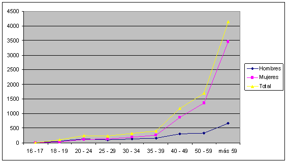

# 2. Perfil del alumnado

Una vez que hemos delimitado el concepto y analizado el sentido de estas enseñanzas, vamos a estudiar el perfil sociológico de su alumnado.

El 70% del alumnado es mayor de 50 años y la mitad tiene 60 o más años. La mujeres representan el 77,23%. Por tanto, podemos deducir que la motivación principal de este alumnado es el desarrollo personal, la participación social o el ocio cultural.

Si observamos el gráfico de la distribución de la matrícula por edad y sexo, apreciamos visulamente esta característica. La curva crece de forma notable a partir del tramo de edad 35-39 años y la diferencia entre hombres y mujeres que hasta este tramo de edad no había sido significativa, se hace más acusada conforme aumneta la edad.

## Importante

**MATRÍCULA DE ENSEÑANZAS DE PROMOCIÓN Y EXTENSIÓN EDUCATIVA**

**CURSO 2012/13**

**Distribución por edad y sexo**
<td nowrap="nowrap" valign="bottom" width="80"> </td><td nowrap="nowrap" valign="bottom" width="50">**Total**</td><td nowrap="nowrap" valign="bottom" width="48">**16 - 17**</td><td nowrap="nowrap" valign="bottom" width="48">**18 - 19**</td><td nowrap="nowrap" valign="bottom" width="48">**20 - 24**</td><td nowrap="nowrap" valign="bottom" width="48">**25 - 29**</td><td nowrap="nowrap" valign="bottom" width="48">**30 - 34**</td><td nowrap="nowrap" valign="bottom" width="48">**35 - 39**</td><td nowrap="nowrap" valign="bottom" width="48">**40 - 49**</td><td nowrap="nowrap" valign="bottom" width="48">**50 - 59**</td><td nowrap="nowrap" valign="bottom" width="48">**más 59**</td>
<td nowrap="nowrap" valign="bottom" width="80">**Hombres**</td><td nowrap="nowrap" valign="bottom" width="50">1892</td><td nowrap="nowrap" valign="bottom" width="48">0</td><td nowrap="nowrap" valign="bottom" width="48">60</td><td nowrap="nowrap" valign="bottom" width="48">126</td><td nowrap="nowrap" valign="bottom" width="48">103</td><td nowrap="nowrap" valign="bottom" width="48">130</td><td nowrap="nowrap" valign="bottom" width="48">153</td><td nowrap="nowrap" valign="bottom" width="48">310</td><td nowrap="nowrap" valign="bottom" width="48">339</td><td nowrap="nowrap" valign="bottom" width="48">671</td>
<td nowrap="nowrap" valign="bottom" width="80">**Mujeres**</td><td nowrap="nowrap" valign="bottom" width="50">6419</td><td nowrap="nowrap" valign="bottom" width="48">1</td><td nowrap="nowrap" valign="bottom" width="48">35</td><td nowrap="nowrap" valign="bottom" width="48">118</td><td nowrap="nowrap" valign="bottom" width="48">126</td><td nowrap="nowrap" valign="bottom" width="48">188</td><td nowrap="nowrap" valign="bottom" width="48">258</td><td nowrap="nowrap" valign="bottom" width="48">869</td><td nowrap="nowrap" valign="bottom" width="48">1361</td><td nowrap="nowrap" valign="bottom" width="48">3463</td>
<td nowrap="nowrap" valign="bottom" width="80">**Total**</td><td nowrap="nowrap" valign="bottom" width="50">8311</td><td nowrap="nowrap" valign="bottom" width="48">1</td><td nowrap="nowrap" valign="bottom" width="48">95</td><td nowrap="nowrap" valign="bottom" width="48">244</td><td nowrap="nowrap" valign="bottom" width="48">229</td><td nowrap="nowrap" valign="bottom" width="48">318</td><td nowrap="nowrap" valign="bottom" width="48">411</td><td nowrap="nowrap" valign="bottom" width="48">1179</td><td nowrap="nowrap" valign="bottom" width="48">1700</td><td nowrap="nowrap" valign="bottom" width="48">4134</td>
<td nowrap="nowrap" valign="bottom" width="80">** **</td><td nowrap="nowrap" valign="bottom" width="50"> </td><td nowrap="nowrap" valign="bottom" width="48"> </td><td nowrap="nowrap" valign="bottom" width="48"> </td><td nowrap="nowrap" valign="bottom" width="48"> </td><td nowrap="nowrap" valign="bottom" width="48"> </td><td nowrap="nowrap" valign="bottom" width="48"> </td><td nowrap="nowrap" valign="bottom" width="48"> </td><td nowrap="nowrap" valign="bottom" width="48"> </td><td nowrap="nowrap" valign="bottom" width="48"> </td><td nowrap="nowrap" valign="bottom" width="48"> </td>
<td nowrap="nowrap" valign="bottom" width="80">**Hombres**</td><td nowrap="nowrap" valign="bottom" width="50">22,77</td><td nowrap="nowrap" valign="bottom" width="48">0,00</td><td nowrap="nowrap" valign="bottom" width="48">3,17</td><td nowrap="nowrap" valign="bottom" width="48">6,66</td><td nowrap="nowrap" valign="bottom" width="48">5,44</td><td nowrap="nowrap" valign="bottom" width="48">6,87</td><td nowrap="nowrap" valign="bottom" width="48">8,09</td><td nowrap="nowrap" valign="bottom" width="48">16,38</td><td nowrap="nowrap" valign="bottom" width="48">17,92</td><td nowrap="nowrap" valign="bottom" width="48">35,47</td>
<td nowrap="nowrap" valign="bottom" width="80">**Mujeres**</td><td nowrap="nowrap" valign="bottom" width="50">77,23</td><td nowrap="nowrap" valign="bottom" width="48">0,02</td><td nowrap="nowrap" valign="bottom" width="48">0,55</td><td nowrap="nowrap" valign="bottom" width="48">1,84</td><td nowrap="nowrap" valign="bottom" width="48">1,96</td><td nowrap="nowrap" valign="bottom" width="48">2,93</td><td nowrap="nowrap" valign="bottom" width="48">4,02</td><td nowrap="nowrap" valign="bottom" width="48">13,54</td><td nowrap="nowrap" valign="bottom" width="48">21,20</td><td nowrap="nowrap" valign="bottom" width="48">53,95</td>
<td nowrap="nowrap" valign="bottom" width="80">**Total**</td><td nowrap="nowrap" valign="bottom" width="50">100,00</td><td nowrap="nowrap" valign="bottom" width="48">0,01</td><td nowrap="nowrap" valign="bottom" width="48">1,14</td><td nowrap="nowrap" valign="bottom" width="48">2,94</td><td nowrap="nowrap" valign="bottom" width="48">2,76</td><td nowrap="nowrap" valign="bottom" width="48">3,83</td><td nowrap="nowrap" valign="bottom" width="48">4,95</td><td nowrap="nowrap" valign="bottom" width="48">14,19</td><td nowrap="nowrap" valign="bottom" width="48">20,45</td><td nowrap="nowrap" valign="bottom" width="48">49,74</td>

Los números se refieren a personas físicas, es decir, un alumno que se haya matriculado en más de un curso, sólo se contabiliza una vez.

## Importante1

**MATRÍCULA DE ENSEÑANZAS DE PROMOCIÓN Y EXTENSIÓN EDUCATIVA**

**CURSO 2012/13**

**Distribución por edad y sexo**

