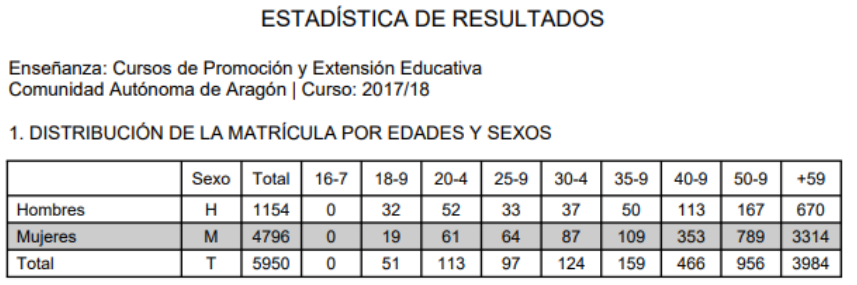
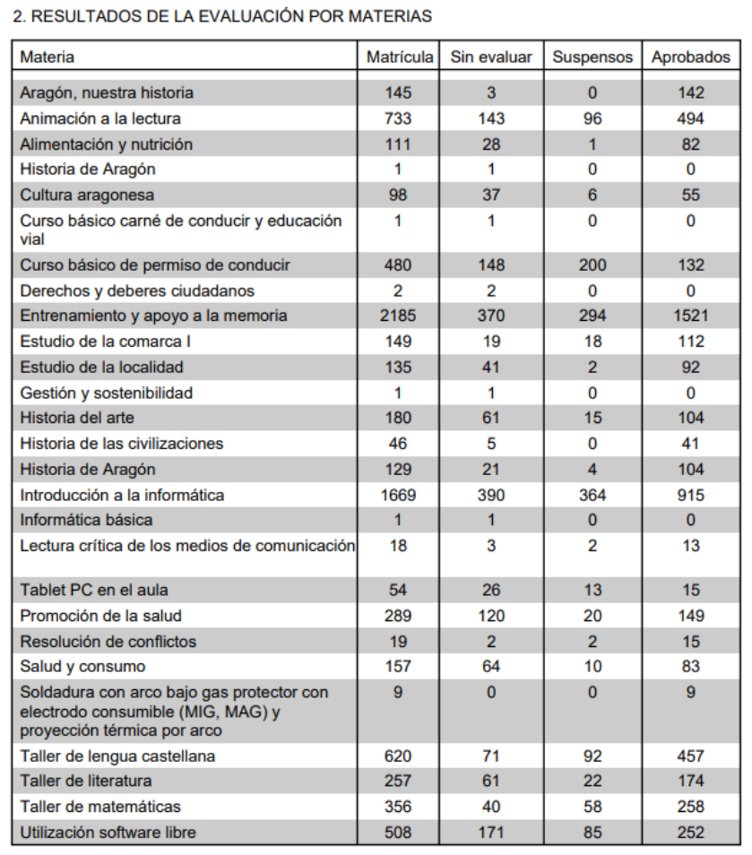

# 2. Perfil del alumnado

Definido el concepto y analizado el sentido de estas enseñanzas, el siguiente cuadro estadístico de distribución de la matrícula por edades y sexo en el curso 2017-18, nos muestra los siguientes datos:

- Más de un 83% de los participantes es mayor de 50 años
- Las mujeres representan el 80% del total de matrículas.

Según esta estadística podríamos deducir que la motivación principal de este alumnado es el desarrollo personal, la
participación social o el ocio cultural.

## Importante

En cuanto a los resultados por materias, los cursos con mayor seguimiento son los de Entrenamiento y apoyo a la memoria e Introducción a la informática, que suponen casi la mitad de las inscripciones. Puedes realizar tu propio seguimiento de la tabla siguiente donde podrás comprobar la diversidad de cursos, la desigual demanda que se produce y los distintos grados de superación en el análisis de los resultados.

