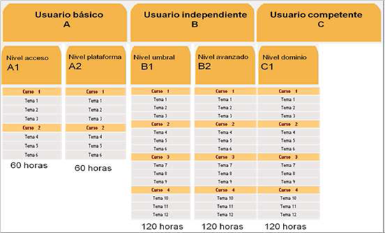

# 3.1. Funcionamiento de la plataforma

## Contenidos2

El AVE consta de tres escenarios: el escenario de trabajo y de comunicación del alumno; el entorno reservado a los profesores para el trabajo individual y para el intercambio de actividades y experiencias con otros tutores; y el entorno de administración, creado para dar de alta y de baja a los alumnos.

Visiona este video del Instituto Cervantes para conocer qué es AVE. [http://cervantestv.es/2010/09/03/aula-virtual-de-espanol/](http://cervantestv.es/2010/09/03/aula-virtual-de-espanol/). Disponible en inglés [http://cervantestv.es/2010/09/03/aula-virtual-de-espanol-2/](http://cervantestv.es/2010/09/03/aula-virtual-de-espanol-2/)

## Contenidos2

**La Mesa de trabajo y plataforma de administración**

La mesa de trabajo del AVE es un entorno multimedia que ofrece al alumnado y al profesorado recursos de audio, video, animaciones, lectura y escritura…

Una gran ventaja que nos ofrece esta plataforma es que cada alumno puede trabajar conforme a su nivel e incluso es un buen recurso para animar y dinamizar las clases presenciales de **español para extranjeros** utilizándolas en trabajo en grupo con un ordenador conectado a un proyector.

En grupos no muy numerosos pueden atenderse ambas enseñanzas e incluso combinarlas, podemos hacer media clase de español presencial y el resto de la duración dejar al alumnado trabajar con el AVE y atender sus dudas puntuales.

Visiona esta fantástica animación para conocer el funcionamiento de la sala de estudio del alumno AVE.

[http://ave.cervantes.es/guias/AVE/guia_es.htm](http://ave.cervantes.es/guias/AVE/guia_es.htm)

Disponible también en  [alemán](http://ave.cervantes.es/guias/AVE/guia_de.htm), [chino](http://ave.cervantes.es/guias/AVE/guia_chi.htm), [francés](http://ave.cervantes.es/guias/AVE/guia_fr.htm), [inglés](http://ave.cervantes.es/guias/AVE/guia_en.htm), [italiano](http://ave.cervantes.es/guias/AVE/guia_it.htm) y [portugués](http://ave.cervantes.es/guias/AVE/guia_pt.htm). Lamentablemente no está disponible en árabe, urdú o rumano (moldavo).

A continuación revisa el documento [**SALA_DE_ESTUDIO **](SALA_DE_ESTUDIO.pdf)para conocer el entorno del Aula Virtual de Español y tras él revisa el documento [**Estructura y organización del AVE **](457374727563747572615f795f6f7267616e697a616369c3b36e5f64656c5f415645.pdf)con el que conocerás todas las peculiaridades del aula virtual que utiliza el alumno AVE.

Ahora vamos a conocer la plataforma de administración, a la que accedemos desde [http://www.admin.ave.cervantes.es/](http://www.admin.ave.cervantes.es/)

Revisa el documento [**Funcionamiento_AdministraciOn_Plataforma_AVE**](Funcionamiento_AdministraciOn_Plataforma_AVE.pdf) para familiarizarte con la administración puesto que en todo el proceso somos los propios tutores de aula los responsables de la matriculación, alta del alumno, seguimiento y evaluación.

## Contenidos2

**La prueba VIA**

La prueba VIA (**Valoración Inicial del Alumno**) es una utilidad muy interesante, especialmente para alumnado que no ha cursado previamente un curso AVE, también es muy interesante para el trabajo en grupo en el aula de español presencial utilizándola con un proyector.

Niveles y subniveles de AVE:

 

Los Cursos de español del AVE se estructuran en los cinco primeros niveles de aprendizaje del Plan curricular del Instituto Cervantes y del Marco común europeo de referencia: A1, A2, B1, B2 y C1.

Cada uno de los dos primeros niveles se divide en dos cursos que son, para el nivel A1, A1.1 y A1.2; para el nivel A2, A2.1 y A2.2. El resto de los niveles se dividen en cuatro cursos, para el nivel B1, B1.1, B1.2, B1.3 y B1.4; y así sucesivamente. Los niveles A1 y A2 tienen una duración mínima de 60 horas. Los niveles B1, B2 y C1 tienen una duración mínima de 120 horas.

Tenemos la posibilidad de matricular al alumnado por subniveles (A.1.1., A.1.2., B.1.1…) o por niveles completos A1, A2, B1… con la peculiaridad que si matriculamos por subniveles el alumno recibe el certificado por cada subnivel que termina mientras que si le matriculamos en el nivel completo sólo obtendrá el certificado al finalizar todo el nivel completo y no podrá recibirlo (ni tampoco un subnivel) si lo deja antes de finalizarlo.

La prueba de nivel de AVE se encuentra en la antigua plataforma [http://ave.cervantes.es/](http://ave.cervantes.es/)**. **Alternativamente puedes acceder directamente desde [aquí](http://ave.cervantes.es/prueba_nivel/registro/test_de_clasificacion.php?origen=webAVE) o buscar en Google "prueba de nivel aula virtual de español instituto cervantes".

## Contenidos2

**Modalidades presencial, semipresencial o a distancia**

El AVE es un recurso de aprendizaje que puede explotarse en la clase presencial y en las modalidades de enseñanza semipresencial y a distancia.

Existe un curso de formación de tutores destinado a profesores de español como lengua extranjera que van a emplear profesionalmente el AVE en cualquiera de sus modalidades : a distancia, semipresencial o presencial.

Este curso no es diferente en cualquiera de sus opciones puesto que las labores docentes y administrativas en cualquiera de los casos por parte del tutor son prácticamente idénticas.

Consideramos **modalidad presencial** a aquel alumno o grupo de alumnos que trabajan dentro del aula en un horario establecido y en el que el tutor está presente durante toda la sesión. Aunque el tutor esté presente durante toda la sesión cada alumno puede estar trabajando en un ordenador diferente con su propio nivel y a su propio ritmo y el tutor atenderá las dudas puntuales y realizará las aclaraciones y explicaciones pertinentes cuando el alumno lo requiera.

**Modalidad semipresencial** es aquella en la que el alumno estudia habitualmente en casa y acude al aula con cierta frecuencia a resolver dudas, trabajar en grupo, consultar el estado de matrícula o comunicar la finalización del curso. Es una modalidad adecuada cuando se trata de un alumno con experiencia previa en AVE para fomentar la comunicación vía e-mail y el trabajo autónomo.

**La modalidad a distancia** sería aquella en la el alumno acude al aula exclusivamente para matricularse, examinarse o renovar su matrícula. Las dudas en este caso deberán resolverse vía telémática. Sólo está recomendada para aquellos alumnos con mucha experiencia en AVE y el uso de las TIC’s.

Para los alumnos que prefieran aprender de forma autónoma, la disponibilidad de texto, sonido e imágenes en los productos multimedia ofrece a los estudiantes muestras de lengua en su contexto real, atractivas presentaciones y ejercicios interactivos con los que practicar los contenidos.

En cualquiera de las tres modalidades el tutor orienta, aconseja y lleva a cabo la evaluación.
