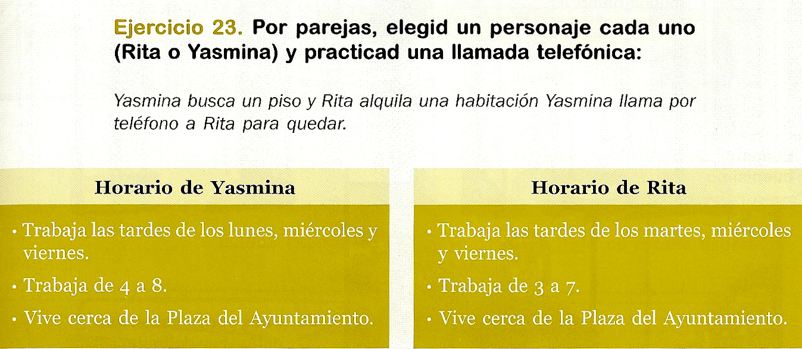
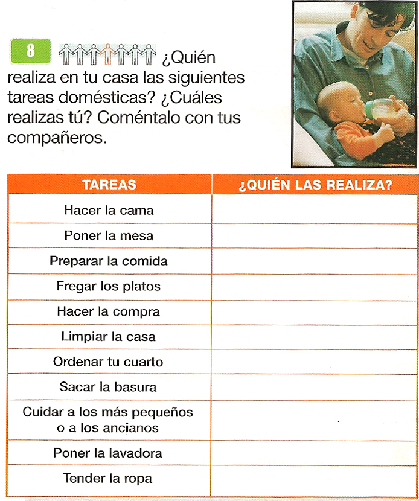

# 3.2. La expresión/interacción oral

Una de las características de la lengua oral frente a la escritura es la **inmediatez**. El hablante apenas tiene tiempo para analizar el discurso que va a emitir. Sólo en situaciones de exposición oral previstas, el hablante ha podido preparar detenidamente la forma de su discurso; pero la situación comunicativa más frecuente en nuestra vida cotidiana no es la exposición sino **la conversación**.

Conversamos para expresar ideas, opiniones, la intención o el deseo de hacer algo, para resolver un problema, mantener relaciones sociales…

En cuanto a los tipos de conversaciones, algunas siguen unas pautas socialmente acordadas (la visita al médico, la resolución de un trámite administrativo, la compra del pan…); otras, sin embargo, tienen un contenido más impredecible y su objetivo es mantener relaciones sociales.

Unas y otras, frente a lo que pueda parecer, siguen un código de conducta tácito bastante rígido, determinado por factores educacionales, culturales... En este sentido, los turnos de palabra y las señales que indican cuándo y cómo se va a producir un intercambio de turno, son algunos de los elementos más estudiados. Por ejemplo: la mirada, la entonación, los gestos… son señales y elementos no lingüísticos a los que también debemos prestar atención.

Si analizamos conversaciones reales producidas por nativos, veremos que la conversación se caracteriza por el uso de recursos para posibilitar la comunicación y compensar las dificultades o los errores cometidos. En buena parte de las conversaciones, los interlocutores comparten un **contexto conocido** para ambos, esta cuestión unida a la **inmediatez** del discurso y al **propósito de la conversación**, hace que utilicemos **recursos** como:

- Omisión de información no necesaria.
- Simplificación de estructuras sintácticas.
- Repeticiones.
- Anteposición de información relevante.
- Reestructuración de las oraciones.
- Reformulación de lo dicho.
- Titubeos y uso de fórmulas que permitan dejar pensar al hablante (mm… , pues…, eh…).

Estos recursos no suelen aparecer en las conversaciones de los libros de texto, ni en las grabaciones preparadas, en las que el discurso es muy limpio y un tanto irreal. Tampoco los hablantes nativos son muchas veces conscientes de su uso. Cuando aprendemos una nueva lengua, solemos considerar que usamos estos recursos porque no sabemos comunicarse bien en ella, sin darnos cuenta de que en nuestra lengua materna los usamos sin problema. Por lo tanto, en el aula deberemos facilitar que los alumnos puedan observar conversaciones reales entre nativos y tomen conciencia de la normalidad de su uso.

La enseñanza de la expresión oral a personas inmigrantes tendrá como objetivo que los alumnos sean capaces de interaccionar en numerosos tipos de conversaciones **desde niveles iniciales **de conocimiento de la lengua, tanto en conversaciones **formales como informales**, y que cuenten con recursos comunicativos que les permitan iniciar una conversación, mantenerla, reconducirla, solicitar aclaraciones y concluirla.

Por ello, tendremos en cuenta las siguientes cuestiones:

**La escucha no conduce directamente al habla**: La expresión oral es una de las destrezas que menos se trabaja cuando el profesor centraliza la clase y dedica todo el tiempo a realizar explicaciones sobre la lengua. Sin embargo, en nuestro caso, es la destreza más necesaria y prioritaria para los alumnos principiantes. La escucha no conduce de forma espontánea al habla. Es cierto que los alumnos necesitan recibir **input** real, observarlo, analizarlo… pero eso no provocará automáticamente su capacidad de expresión. A hablar se aprende hablando. No obstante, el habla tampoco se puede forzar mediante actividades que provoquen la ansiedad de los alumnos. Debemos procurar un ambiente relajado, en el que el habla surja de forma natural, a través, por ejemplo, de debates sobre temas de interés para el grupo, utilizando diferentes lenguas si es necesario. La enseñanza por tareas también nos ayudará a generar de forma natural conversaciones reales en el aula para resolver las tareas.

**Es necesario exponer a los alumnos a usos conversaciones reales del español**: Ya hemos visto que determinadas conversaciones siguen unas pautas previsibles y que la conversación tiene rasgos socialmente compartidos.  Es necesario preparar a nuestros alumnos para conocer esas pautas, identificar esos rasgos, utilizarlos y ser más competentes en cada situación. Pero la conversación no depende sólo de una persona ni de lo socialmente establecido, sino también del contexto y de los giros inesperados que puedan introducir los interlocutores. Hay que tener cuidado por tanto con las conversaciones simplificadas, cerradas y “enlatadas” de los manuales, pueden ser una ayuda pero debemos avanzar un paso más. El docente debe ser un observador y un estudioso del español que se utiliza en conversaciones auténticas y evitar una transmisión de usos irreales de la lengua. Los aprendices del español que viven en otros países pueden no acusar tanto estos errores, pero nuestros alumnos viven en inmersión y necesitan usar un español auténtico fuera del aula.

**Las conversaciones entre pares son fundamentales**: Las conversaciones reales entre alumno y profesor, generadas de forma natural por la propia dinámica de la clase, son un buen entrenamiento para trabajar la expresión oral. Pero también está demostrado que las conversaciones entre los propios alumnos, cuando trabajan en pequeños grupos para resolver una tarea, son de gran valor en el aprendizaje. Nos referimos de nuevo a conversaciones reales, no simulaciones. Estas conversaciones les ayudan a desinhibirse, favorecen la negociación de significado y el andamiaje entre alumnos de diferentes niveles.

 

**Observa las siguientes actividades**: *¿Qué conocimientos previos se necesitan para resolver las actividades? ¿A qué metodología responde cada una? ¿Qué tipo de conversaciones pueden generar en el aula?*

