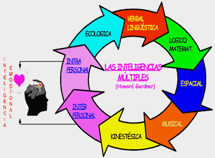

# 3.2. Tipos de inteligencias múltiples

### INTELIGENCIA. TEORÍA DE LAS INTELIGENCIAS MÚLTIPLES DE H. GARDNER (1983)

**Inteligencia es** la capacidad para resolver [problemas](http://www.monografias.com/trabajos15/calidad-serv/calidad-serv.shtml#PLANT) cotidianos, para generar nuevos problemas, para crear [productos](http://www.monografias.com/trabajos12/elproduc/elproduc.shtml) o para ofrecer [servicios](http://www.monografias.com/trabajos14/verific-servicios/verific-servicios.shtml) dentro del propio ámbito cultural.

Al definir la inteligencia como una capacidad, Gardner la convierte en una destreza que se puede desarrollar. No niega el componente genético: todos nacemos con unas potencialidades marcadas por la genética; estas potencialidades se van a desarrollar de una manera u otra dependiendo del medio ambiente, nuestras experiencias, la educación recibida, etc.

**La Teoría** de las inteligencias múltiples**se encuadra en la psicología cognitiva, disciplina que surge en los años sesenta y setenta del pasado siglo. La psicología cognitiva estudia la forma en la que el ser humano adquiere, representa y activa el conocimiento del mundo que lo rodea. Nos presenta una comprensión más amplia del ser humano y de las distintas formas que tiene para aprender y manifestar sus conocimientos intelectuales y sociales.

**Howard Gardner**, en su obra **“Estructuras de la Mente” (1987)**, propone que existen normalmente en el ser humano siete tipos de inteligencias (lingüística, lógico-matemática, musical, espacial, kinestesicocorporal, interpersonal e intrapersonal),aunque en la actualidad se plantea la existencia de otras inteligencias como la ecológica, digital y la espiritual.

La mayoría de los individuos tenemos la totalidad de esas inteligencias, cada una desarrollada de modo y aun nivel particular, producto  de la herencia de cada uno, de su interacción con el ambiente y de la cultura en que se integra. Estas formas de inteligencia interactúan y se edifican desde el principio de la vida, aunque existe una tendencia innata de cada ser humano para desarrollar una o dos formas de inteligencia más que las demás, para explicar esta tendencia Gardner, hace una comparación entre los dispositivos de una computadora para el procesamiento de cierto tipo de información, es decir, que el cerebro de un individuo en particular, tiene ciertas estructuras que le hacen más sensible a un determinado tipo de información, aunque el ejemplo de ninguna manera pretende hacer creer que el cerebro humano funcione igual que una computadora.

Ofrecer actividades acordes con las habilidades, intereses e inteligencias desarrolladas en nuestros estudiantes, les permitirá motivarse a descubrir su propio conocimiento, mejorando así el proceso de enseñanza – aprendizaje y también mejorará nuestro propio trabajo como maestros:

- No todos tenemos los mismos intereses y capacidades.
- No todos aprendemos de la misma manera.
- Nadie puede aprender exacta y específicamente todo lo que tiene que aprender.

>**tip**
>## Para saber más
>
>**Intervención reflexiva en el foro**
>
>Entra en el siguiente enlace y observa esta tabla de los distintos tipos de inteligencia.
>
>- [TIPOS DE INTELIGENCIA](http://aularagon.catedu.es/materialesaularagon2013/fepa/zips/Modulo_2/TIPOS_DE_INTELIGENCIA.pdf)

## Actividad del foro

**Intervención reflexiva en el foro**

Entra en el foro y reflexiona, expresando tu opinión acerca de cuál debe ser el rol del profesor en los centros de adultos, dadas las características de nuestros alumnos.
