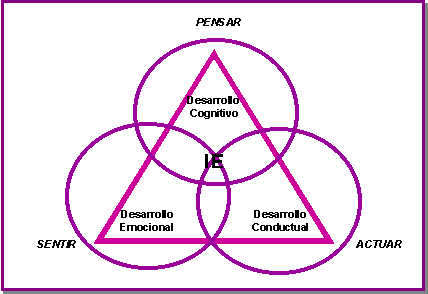

# 3.3. Inteligencia Emocional e Inteligencia Social

>“Mi principal interés está precisamente centrado en esas otras características a las que hemos dado en llamar inteligencia emocional, características como la capacidad de motivarnos a nosotros mismos, de perseverar en el empeño a pesar de posibles frustraciones, de controlar los impulsos, de diferir las gratificaciones, de regular nuestros propios estados de ánimo, de evitar que la angustia interfiera con nuestras facultades racionales y, por último – pero no por ello menos importante-, la capacidad de empalizar y confiar en los demás.

>A diferencia de lo que ocurre en el C.I. (Coeficiente Intelectual), cuya investigación sobre centenares de miles de personas tiene casi un siglo de historia, la inteligencia emocional es un concepto muy reciente (…). Lo que sí podemos hacer, a la vista de los datos de que disponemos, es avanzar que la inteligencia emocional puede resultar tan decisiva – y en ocasiones, incluso más- como el C.I. Y, frente a los que son de que ni la experiencia ni la educación pueden modificar substancialmente el resultado del C.I., trataré de demostrar (….) que, si nos tomamos la molestia de educarles, nuestros hijos pueden aprender a desarrollar las habilidades emocionales fundamentales.

>**D. Goleman**. **Inteligencia emocional**

El término Inteligencia Emocional fue acuñado por dos psicólogos de la Universidad de Yale (Peter Salovey y John Mayer) y difundido mundialmente por Daniel Goleman.

- Es la capacidad de sentir, entender, controlar y modificar estados anímicos propios y ajenos.
- **“Una forma de inteligencia social que implica la habilidad para dirigir los propios sentimientos y emociones y las de los demás, saber discriminar entre ellos y usar esta información para guiar el pensamiento y la propia acción.” **(Salovey, Mayer)
- Es la capacidad de un individuo de controlar, usar, y potenciar el manejo de sus impulsos emocionales en forma positiva aún en situaciones adversas.

Se trata de conectar las emociones con uno mismo; saber qué es lo que siento, poder verme a mí y ver a los demás de forma positiva y objetiva. La Inteligencia Emocional es la capacidad de interactuar con el mundo de forma receptiva y adecuada. Goleman explica que la Inteligencia Emocional es el conjunto de habilidades que sirven para expresar y controlar los sentimientos de la manera más adecuada en el terreno personal y social. Incluye, por tanto, un buen manejo de los sentimientos, motivación, perseverancia, empatía o agilidad mental. Justo las cualidades que configuran un carácter con una buena adaptación social.

### Concepto de competencia y clases

**Competencia** es el conjunto de conocimientos, capacidades, habilidades y actitudes necesarias para realizar actividades diversas con un cierto nivel de calidad y eficacia**.

En el concepto de competencia se integra el saber, saber hacer ysaber ser. El dominio de una competencia permite producir un número infinito deacciones no programadas.

Dentro de las competencias se pueden distinguir las técnicas (saber), las metodológicas (saber hacer) y otras (saber ser) que se refieren a las competencias socio-emocionales.

### Características de la competencia emocional

La competencia emocional se puede entender *como el conjunto de conocimientos, capacidades, habilidades y actitudes necesarias para comprender, expresar y regular de forma apropiada los fenómenos emocionales*.

Entre las competencias emocionales se pueden distinguir dos grandes bloques:

a) Capacidades de autorreflexión (inteligencia intrapersonal): identificar las propias emociones y regularlas de forma apropiada

b) Habilidad de reconocer lo que los demás están pensando y sintiendo (inteligencia interpersonal): habilidades sociales, empatía, captar la comunicación no verbal, etc.
