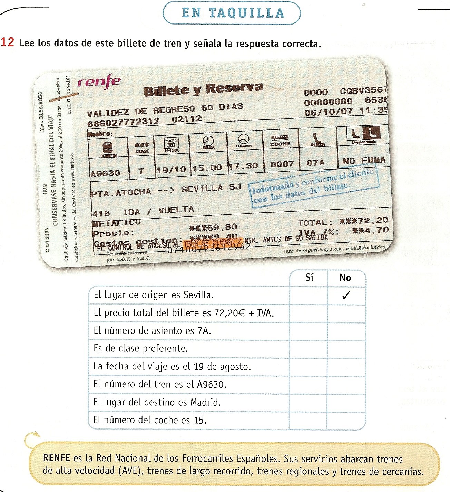

# 3.3. La comprensión lectora

Tal y como ocurre con la comprensión oral, la comprensión lectora es un **proceso activo de interpretación** del texto. La comprensión lectora supone la activación de nuestros conocimientos previos: conocimientos sobre el tema, sobre el código y sobre los procesos que intervienen en la lectura.

La comprensión lectora abarca la superación de tres niveles de lectura:

1. **Nivel de la decodificación**. El lector tiene que ser capaz de reconocer los signos de la escritura y transferirlos al lenguaje oral. La decodificación implica además dotar de significado a las palabras.
1. **Nivel de la comprensión**. El lector tiene que ser capaz de comprender el significado global del texto.
1. **Nivel de interpretación**. El lector tiene que ser capaz de diferenciar las ideas principales de las secundarias, captar los significados tácitos, aplicar la inferencia y deducir el significado de palabras, refranes, diagramas…, interpretar los objetivos del texto y el mensaje que trata de  emitir el autor.

A diferencia de la oralidad, la competencia lectora en la lengua materna no se inicia de forma natural en la infancia sino que va unida a la escolaridad y al nivel de instrucción de la persona.

Sabemos con certeza que todos los alumnos serán hablantes de una o varias lenguas. Con mayor o menor nivel de desarrollo, todos poseerán competencia comunicativa en su lengua materna y quizá en otras lenguas. Pero puede darse el caso de que no todos tengan una competencia lectora suficiente en su lengua materna como para lograr la interpretación de un texto. Quizá algunos de ellos hayan estado escolarizados durante un breve espacio de tiempo o no se hayan iniciado en el proceso de alfabetización.

En este sentido, es importante que el docente conozca el nivel de competencia lectora del alumno en su lengua materna o en otras lenguas, (debemos tener en cuenta que muchas lenguas africanas son ágrafas, sin tradición escrita. En algunos países, la escolaridad se desarrolla en las lenguas de colonización, como el inglés o el francés). La lectura es un proceso complejo, en el que se ponen en funcionamiento habilidades, estrategias y técnicas, que, si no se poseen, deben entrenarse en el aula. Es por ello que debemos estar preparados para desarrollar la enseñanza de la lectoescritura a personas adultas de forma adecuada (Tenemos que evitar los errores que cometían a este respecto los “bienintencionados” de los que hablaba la **Historia de Khalia y Mombo**).

La Educación de Personas Adultas tiene como objetivo la formación integral de la persona y la alfabetización es una de sus prioridades dado el significado que el dominio de la lectoescritura adquiere en la sociedad actual. Una persona adulta no alfabetizada es una persona dependiente que ve limitada su capacidad de actuar, decidir y participar social y culturalmente, es decir, ve limitada su libertad.

Todas las personas deben tener derecho a la alfabetización en su lengua materna. Leer y escribir en nuestra propia lengua nos permite captar los significados más profundos de los textos, disfrutar de su literatura, lograr nuestra expresión más íntima… Es cierto que muchas lenguas no tienen tradición escrita, pero cada vez más se tiende a utilizar alfabetos fonémicos para posibilitar su transcripción.

En algunas comunidades indígenas de Latinoamérica, por ejemplo, se enseña y aprende a leer y a escribir en la lengua materna y en castellano como segunda lengua de forma simultánea, es lo que se denomina alfabetización bilingüe. Bajo esta práctica subyace la valoración de la lengua y de la cultura autóctonas y el desarrollo de la identidad cultural y de la autoestima de los nativos. Para ello, se requiere que los docentes tengan competencia en las cuatro destrezas en ambas lenguas.

Aunque la alfabetización en la propia lengua sea lo más adecuado, en el caso de las personas inmigrantes, es difícil que en el país de destino puedan acceder a una alfabetización en su lengua materna. Si no es posible la alfabetización en la primera lengua, se aconseja que el proceso de lectoescritura se inicie en una lengua de la que se tenga cierto grado de conocimiento oral. 

En conclusión, cuando los alumnos tengan competencia lectora en alguna lengua,  nuestro objetivo será desarrollar su capacidad para interpretar textos escritos en español. Aunque será necesario trabajar en los tres niveles a los que hemos hecho referencia, los alumnos activarán sus conocimientos previos de manera que se tratará de facilitar la trasferencia de procesos, de códigos, etc. procesos adquiridos de los que los alumnos no son a veces conscientes.

Cuando los alumnos no tengan competencia lectora en ninguna lengua y deseen adquirirla en español, tendremos que iniciar o continuar un proceso de alfabetización en español como nueva lengua, conscientes de que se trata de una enseñanza compleja, un tanto artificiosa, pero posible y satisfactoria también para muchas personas, según podemos afirmar desde la experiencia. En este sentido, el trabajo sobre cada uno de los niveles es más costoso, pues habrá menos conocimientos previos que se puedan activar, pero siempre habrá conocimientos previos, esto no hay que olvidarlo.

En uno y otro caso, para desarrollar la comprensión lectora, tendremos en cuenta los siguientes aspectos:

**La lectura es funcional.** Cuando leemos en nuestra vida cotidiana lo hacemos con un objetivo: para disfrutar, para aprender, para informarnos, para comunicarnos, para seguir unas indicaciones… De la misma manera, en el aula, la lectura debe tener un objetivo claro y funcional. Debemos asegurarnos, por tanto, de que trabajamos todas sus funciones y no reducimos la lectura siempre al mismo objetivo.

**Los textos deben estar relacionados con la función de la lectura.** En la mayoría de los manuales de E/LE, los textos que hay que leer son reproducciones de conversaciones orales, instrucciones de actividades o  textos que ya no son de actualidad ni conectan con las necesidades lectoras de los alumnos. Es preferible utilizar textos auténticos, de uso social, relacionados con las necesidades lectoras de los alumnos y con sus preferencias. Algunos textos de utilidad pueden ser: **el periódico del día, un mensaje de correo, la letra de una canción, la definición de una palabra, un billete de autobús, un plano, el horario de una biblioteca, la etiqueta de algún producto, un impreso, un cartel que hayamos visto en un lugar público, una nómina, un contrato, un prospecto médico, una receta de cocina, un calendario, un relato, una viñeta cómica, un anuncio publicitario, las instrucciones de una actividad, información de wikipedia sobre ciudades de origen, un programa de fiestas, la interfaz de Google…**

 

**Observa las siguientes actividades**: *¿Qué conocimientos previos se necesitan para resolver las actividades? ¿Qué tipo de textos se utilizan? ¿Proponen una lectura funcional? ¿Por qué?*

