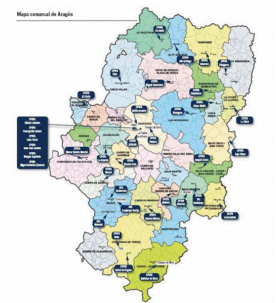

# 3.3. Red pública

### La organización y red de Centros según la normativa.

Según la **ORDEN de 16 de agosto de 2000, **los Centros Públicos de Educación de Adultos dependientes de la Comunidad Autónoma de Aragón atenderán un ámbito territorial, sobre el que desempeñen funciones de planificación, coordinación, desarrollo, evaluación y extensión de la educación de personas adultas y cuyo alcance quedará reflejado en su Programación General Anual.

Las actuaciones financiadas para el desarrollo de ofertas formativas dirigidas a la población adulta serán adscritas como Aulas al Centro en cuyo ámbito territorial se encuentren ubicadas, exceptuando aquéllas que tengan la calificación de Centro.

La **LEY 16/2002, de 28 de junio, de educación permanente de Aragón**, especifica en su Título IV:

- Los Centros de Educación Permanente tendrán carácter territorial y para cada uno de ellos se establecerá una sede o ubicación principal, sin perjuicio de lo cual podrán ejercer sus funciones en distintas localizaciones dentro de su ámbito territorial.
- Podrán crearse Aulas de Educación Permanente cuya titularidad corresponda a otra Administración o entidad sin fines de lucro distinta de la Diputación General de Aragón. Estas Aulas de Educación Permanente estarán adscritas a un Centro público de Educación Permanente.
- Con carácter complementario, podrán crearse, en los Institutos de Educación Secundaria, Secciones de Educación Permanente, que colaborarán en la ejecución de la planificación educativa del Centro público de adultos de su ámbito territorial.

<td valign="top" width="576">Mapa comarcal de Aragón y Red de Centros públicos de EPA (del Plan de Promoción para el Aprendizaje en Aragón, curso 2012-13, editado por el Departamento de Educación, Universidad, Cultura y Deporte del Gobierno de Aragón.)</td>

>**info**
>## Importante
>
>[**Plan de formación para el aprendizaje permanente de Aragón 2018-19**](http://www.educaragon.org/FILES/Plan_Aprendizaje_Permanente_2018_19%20.pdf).

 

 
