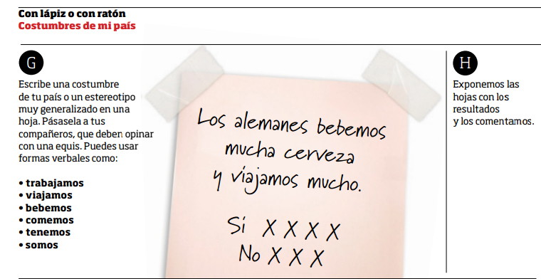

# 3.4. La expresión escrita

Sabemos que la escritura **no es la simple transcripción de la oralidad**. El código escrito suele diferenciarse del oral por las siguientes características: **canal visual, discurso más elaborado, no inmediato, se puede revisar, condicionado por normas sociales más estables** **(por ejemplo, el lenguaje jurídico, o una carta formal)…  **Aunque también hay que tener en cuenta que estas diferencias dependen del canal, de la finalidad, del contexto de uso… Por ejemplo, no es lo mismo un chat que un mensaje formal, aunque en ambos se utilice el código escrito.

También sabemos que **leer es un proceso diferente al de escribir**. Cuando leemos, adoptamos ante el texto una postura muy diferente a cuando escribimos. En cada caso necesitamos poner en marcha conocimientos y procesos distintos.

Escribir un texto implica un **proceso de producción**. En ese proceso, el autor debe pensar qué va a decir, cómo lo va a decir y qué necesita para hacerlo. Necesitará activar conocimientos previos sobre el tema y sobre el código. Tomará además decisiones dependientes del tipo de texto, del destinatario, del objetivo o fin que persigue, del medio utilizado… El proceso de producción de un texto es, por tanto, un **proceso complejo**, que requiere de diferentes fases: ****planificación, elaboración y revisión****.

Escribir es además una **actividad funcional**: escribimos por un motivo, con una finalidad… Piensa para qué necesitas escribir en tu vida cotidiana y piensa con tus alumnos qué y para qué necesitan escribir.

Por ejemplo: **escribimos para recordar la lista de la compra; recordar una dirección; proponer, mediante un mensaje, una cita a los amigos; solicitar la admisión en un curso; solicitar una tutoría al profesor de nuestro hijo; tomar notas en una clase o en una conferencia; opinar sobre un artículo de consumo en un foro; contar lo que hacemos o cómo nos sentimos en las redes sociales; felicitar por un acontecimiento especial; escribir un anuncio; solicitar una cita médica por internet…**

Por lo tanto, no podemos reducir el proceso de escritura a copiar un enunciado del libro, a realizar un listado de palabras, o a otro tipo de actividades que sólo tengan funcionalidad dentro del aula. En el caso de la alfabetización, tampoco podemos reducir la enseñanza de la escritura a copiar letras o palabras sin conexión lógica entre ellas.

La enseñanza de la escritura debe estar **vinculada a las necesidades de la vida cotidiana** de nuestros alumnos, a sus intereses y preferencias, abarcando todo el proceso y sus fases al completo.

Para favorecer el aprendizaje de la expresión escrita, acompañaremos a los alumnos en las diferentes etapas del proceso. De esta forma, podremos facilitar la **adquisición de estrategias** para:

- Seleccionar la información.
- Organizar y estructurar las ideas.
- Compensar el desconocimiento de palabras o estructuras.
- Revisar el texto y autocorregirse.

Escribir en una nueva lengua requiere, además de tener conocimientos sobre el tema, tener conocimientos del código escrito en la lengua meta, de sus convenciones sociales… requiere, en definitiva, que los alumnos se familiaricen previamente con **escritos similares realizados por autóctonos**. Este **input** será necesario para producir textos propios posteriormente. Es por ello que conviene que los alumnos tengan la oportunidad de  **manipular textos reales**. Las actividades pueden consistir, por ejemplo, en:

- **Sustituir algunas palabras del texto por sinónimos.**
- **Reorganizar los párrafos de un texto.**
- **Completar huecos.**
- **Poner un título al texto.**
- **Reescribir un texto similar pero adaptado a una nueva situación.**
- **Completar alguna de las viñetas de un cómic.**
- **Responder preguntas sobre el texto.**
- **Reescribir el final de una historia.**
- **Utilizar los datos personales que se encuentran dentro de un texto para completar un impreso…**

  Estas actividades son aconsejables hasta que los alumnos estén preparados para crear sus propios textos de forma más autónoma.

A la hora de seleccionar los textos, es importante también que tengamos en cuenta que no siempre es el mismo tipo de texto el que necesitamos leer que el que necesitamos escribir. En el caso de una felicitación de cumpleaños, por ejemplo, es posible que unas veces tengamos la ocasión de leerla y otras escribirla. Pero en el caso de una prescripción médica, es más frecuente que sólo necesitemos leerla a no ser que uno de nuestros alumnos sea médico. En definitiva, la selección de textos dependerá de las necesidades de cada grupo, pero siempre tendremos en cuenta si se trata de un texto aconsejable para ser leído, para ser escrito o para ambas cosas.

**Observa esta actividad:** **¿Qué conocimientos previos se necesitan para resolver la actividad? ¿Qué tipo de texto se utiliza? ¿Propone una escritura funcional? ¿Por qué?**

|Sans, N., Martín Peris, E. y Garmendia, A. (2011): [**Bitácora. Libro del alumno**](http://www.difusion.com/uploads/telechargements/catalogue/ele/bitacora/BITACORA1_ud5.pdff). Barcelona. Difusión. Pg. 69.
