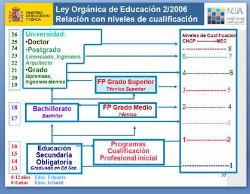

# 1.1. Certificados de profesionalidad: algo de historia

En el año 2002 se redactó la Ley Orgánica 5/2002 de las Cualificaciones y la Formación Profesional que tenía como finalidad:

>"La ordenación de un sistema integral de formación profesional, cualificaciones y acreditación, que respondiera con eficacia y transparencia a las demandas sociales y económicas a través de las diversas modalidades formativas. Todo ello encuadrado en las directivas europeas sobre cualificaciones profesionales."

Las cualificaciones profesionales más significativas del sistema productivo español, organizadas en familias profesionales y niveles integran el Catálogo Nacional de Cualificaciones Profesionales (CNCP)

El CNCP constituye la base para elaborar la oferta formativa de los títulos de Formación Profesional  y los Certificados de Profesionalidad.

El organismo encargado de definir, elaborar y mantener este catálogo es el **Instituto Nacional de Cualificaciones** (INCUAL) .

¿Qué es una **cualificación profesional**?

>“Conjunto de competencias profesionales con significación para el empleo que pueden ser adquiridas mediante formación modular u otros tipos de formación así como a través de la experiencia laboral”. (Art. 7.3 LOCFP 5/2002)

Y, ¿qué es una **competencia profesional**?

>“Conjunto de conocimientos y capacidades que permiten el ejercicio de la actividad profesional conforme a las exigencias de la producción y el empleo.” (Art. 7.3 LOCFP 5/2002)

Los **certificados de profesionalidad** son el instrumento de acreditación oficial, en el ámbito de la administración laboral, de las cualificaciones profesionales del CNCP.

Estas cualificaciones pueden ser  adquiridas

- a través de procesos formativos
- reconocimiento de la experiencia laboral  
- vías no formales de formación

y permiten su correspondencia con los títulos de formación profesional del sistema educativo.

Las cualificaciones se agrupan en 26 **familias profesionales y cinco niveles**:
<table style="width: 100%;" border="1" cellspacing="0" cellpadding="0">

<strong>Familias Profesionales</strong>

<ul>
<li>Agraria</li>
<li>Marítimo-Pesquera</li>
<li>Industrias Alimentarias</li>
<li>Química</li>
<li>Imagen Personal</li>
<li>Sanidad</li>
<li>Seguridad y Medio Ambiente</li>
<li>Fabricación Mecánica</li>
<li>Electricidad y Electrónica</li>
<li>Energía y Agua</li>
<li>Instalación y Mantenimiento</li>
<li>Industrias Extractivas</li>
<li>Transporte y Mantenimiento de Vehículos</li>
<li>Edificación y Obra Civil</li>
<li>Vidrio y Cerámica</li>
<li>Madera, Mueble y Corcho</li>
<li>Textil, Confección y Piel</li>
<li>Artes Gráficas</li>
<li>Imagen y Sonido</li>
<li>Informática y Comunicaciones</li>
<li>Administración y Gestión</li>
<li>Comercio y Marketing</li>
<li>Servicios Socioculturales y a la Comunidad</li>
<li>Hostelería y Turismo</li>
<li>Actividades Físicas y Deportivas</li>
<li>Artes y Artesanías</li>
<tr>

<strong>Niveles de Cualificación</strong>

<tr>
<td width="10%">&nbsp;Nivel 1</td>
<td width="89%">

Competencia en un conjunto reducido de actividades simples, dentro de procesos normalizados.  Conocimientos y capacidades limitados.

<tr>
<td width="10%">&nbsp;Nivel 2</td>
<td width="89%">

Competencia en actividades determinadas que pueden ejecutarse con autonomía.  Capacidad de utilizar instrumentos y técnicas propias.&nbsp;  Conocimientos de fundamentos técnicos y científicos de la actividad del proceso.

<tr>
<td width="10%">&nbsp;Nivel 3</td>
<td width="89%">

Competencia en actividades que requieren dominio de técnicas y se ejecutan con autonomía.  Responsabilidad de supervisión de trabajo técnico y especializado.  Comprensión de los fundamentos técnicos y científicos de las actividades y del proceso.

<tr>
<td width="10%">&nbsp;Nivel 4</td>
<td width="89%">

Competencia en un amplio conjunto de actividades complejas.  Diversidad de contextos con variables técnicas científicas, económicas u organizativas.  Responsabilidad de supervisión de trabajo y asignación de recursos.  Capacidad de innovación para planificar acciones, desarrollar proyectos, procesos, productos o servicios.

<tr>
<td width="10%">&nbsp;Nivel 5</td>
<td width="89%">

Competencia en un amplio conjunto de actividades muy complejas ejecutadas con gran autonomía.&nbsp;  Diversidad de contextos que resultan, a menudo, impredecibles.&nbsp;  Planificación de acciones y diseño de productos, procesos o servicios.  Responsabilidad en dirección y gestión.  &nbsp;

(fuente INCUAL)

Cada nivel se determina según el grado de complejidad, autonomía y responsabilidad necesarios para realizar una  actividad laboral.

La vinculación de las cualificaciones profesionales y los sistemas de Formación Profesional quedan reflejados en el siguiente cuadro. (fuente INCUAL)

Los niveles que más vinculación tienen con las actuaciones en los Centros Públicos de Educación de Adultos son los niveles 1,2,3. Y la procedencia de los alumnos es la siguiente:

1. En la Educación Secundaria Obligatoria: los Programas de Cualificación Profesional Inicial PCPI, la Formación Profesional Básica FPB: Nivel 1 del CNCP.
1. En Formación Profesional: título de Técnico, Formación Profesional, en Secundaria: Nivel 2.
1. En Formación Profesional: título de Técnico Superior, Formación Profesional, en Terciaria: Nivel 3.
1. En enseñanzas deportivas: título de Técnico Deportivo, en Secundaria: Nivel 2.
1. En enseñanzas deportivas: título de Técnico Deportivo Superior, en Terciaria: Nivel 3
