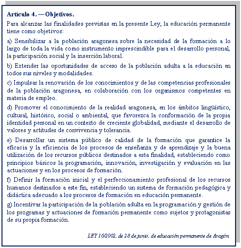

# 4.2. Marco normativo

No podemos olvidar que nos encontramos en el marco de actuación de la Educación de Personas Adultas —con toda la responsabilidad profesional que eso conlleva— y que sus objetivos afectan a **todas las personas**, independientemente de las enseñanzas que se cursen.

A pesar de la relevancia que la competencia comunicativa tiene en nuestros cursos, los alumnos inmigrantes son personas adultas que, como el resto de participantes, tienen otras necesidades de aprendizaje a lo largo de la vida. Consideramos necesario, por tanto, recordar y tener presentes los objetivos generales de la **Ley de Educación Permanente de Aragón:**

Es interesante observar también los programas que se promueven desde esta Ley:

 

Como puedes ver, la enseñanza del español a personas inmigrantes formaría parte del programa de inserción educativa y comunitaria del colectivo. La enseñanza de la lengua no sería, en consecuencia, un fin en sí mismo, sino un medio, un instrumento para que las personas adquieran mayor autonomía y  puedan acceder al ámbito laboral, social, educativo…

 Es decir, la Enseñanza del Español como Nueva Lengua, dentro del marco de la Educación de Personas Adultas, tiene unos objetivos “paraguas” que nos diferencian de los objetivos que se plantean, por ejemplo, las Escuelas Oficiales de Idiomas en las que el aprendizaje de la lengua es el fin en sí mismo. Esto no quiere decir que no necesitemos de la Didáctica del Español como Lengua Extranjera y que no compartamos objetivos más específicos. Al contrario, tenemos que formarnos y apoyarnos en los avances y en las investigaciones que se han realizado en este ámbito para plantear una enseñanza adecuada, y no caer en los errores que Lourdes Miquel atribuye a los “bienitencionados” en su artículo, ¿lo recuerdas?

Aún así, nuestros objetivos generales son más amplios. Por eso, es fundamental conocer las necesidades del grupo meta y valorar qué competencias y enseñanzas tendremos que integrar junto con la enseñanza de la lengua o, mejor dicho, a través del uso de la lengua.

**¿Daremos entonces clases “de español” o “en español”?**

Los profesores responsables de programas bilingües en centros de primaria suelen decir que no dan clases de inglés ni de francés sino en inglés o en francés; así, por ejemplo, dan clase de matemáticas en inglés, o conocimiento del medio en francés…

En este sentido, podemos identificarnos un poco con ellos. Seremos profesores “de español” pero también “en español”. Usaremos el español para ayudar a crear una cuenta de correo electrónico, para explicar el uso de una calculadora, para cumplimentar un impreso o explicar una referencia histórica… si esto es lo que demanda el grupo. Seremos profesores “de/en español”. Por eso, el Enfoque por Tareas y Proyectos, tal y como vimos en el Módulo 2, es una de las metodologías que mejor se adapta al desarrollo de los objetivos globalizadores e integradores que pretendemos. El Enfoque por Tareas nos permitirá plantear tareas de interés para el grupo que no sean propiamente de lengua, pero, para desarrollarlas, tendremos que utilizar la lengua de forma real y reflexionar sobre ese uso. Es una metodología integradora, acorde a nuestros planteamientos.

Por lo que respecta al currículo, entre las Enseñanzas de Extensión y Promoción Educativa que se desarrollan actualmente en nuestra Comunidad, las Enseñanzas de Español cuentan con unas orientaciones que debes conocer y consultar a la hora de realizar las programaciones didácticas. Su **Introducción** y sus **Objetivos Generales** bien pueden servirnos de síntesis de lo comentado en este Módulo.

**INTRODUCCIÓN**

>Un proyecto migratorio implica dejar atrás el propio entorno, las relaciones sociales y familiares de las que se forma parte y en las que la persona tiene una entidad diferencial, para emprender una vida nueva en un contexto extraño, con códigos culturales diferentes, en el que además puede utilizarse una lengua desconocida, en cuyo caso las dificultades para conseguir ser partícipe de la nueva sociedad se acrecientan.
>
>La Educación de Personas Adultas puede ofrecer un acompañamiento que facilite la acogida, una formación integral que aborde necesidades  lingüísticas, sociales y culturales, que permita la decodificación de la nueva realidad y facilite su intervención en ella. Una formación integral, por tanto, que priorice la competencia comunicativa, pero que tenga en cuenta todas las competencias básicas, atendiendo de forma más específica a aquellas que se detecten como necesarias para facilitar el proyecto emprendido.
>
>Para ello, ha de partirse de los conocimientos y experiencias previas del alumnado, como soportes sobre los que poder construir nuevos aprendizajes, pues estos saberes serán sin duda ricos y plurales, dando como resultado grupos heterogéneos desde diferentes perspectivas. La heterogeneidad será, no obstante, valorada de forma positiva, tal y como han demostrado recientes investigaciones, un factor de enriquecimiento del grupo, característica que permitirá el andamiaje colectivo, es decir, el aprendizaje mediado, facilitado por el profesor y por el propio alumnado.
>
>En cuanto a la metodología utilizada, se tendrán en cuenta los nuevos avances que, por ejemplo, se han realizado en el ámbito de la didáctica de lenguas, de manera que el enfoque comunicativo y el aprendizaje mediante tareas se presentan como modelos especialmente adecuados, pues se basan en la acción, en el uso real de la lengua para resolver problemas de interés para el grupo, en el trabajo cooperativo, y en el desarrollo de la autonomía para estimular el aprendizaje.
>
>La situación de inmersión implica que el español sea considerado como una nueva lengua, no extranjera, una lengua que se necesita día a día para formar parte de la sociedad en la que se vive y de la que se debe apropiar la persona. En el aula, se facilitarán, por tanto, estrategias que le permitan aprovechar todas las oportunidades de aprendizaje que se le presenten, tanto dentro como fuera de ella.
>
>Sin embargo, hay que tener en cuenta que una lengua no se aprende de forma lineal, hay que volver sobre los contenidos para profundizar en ellos, es decir, el aprendizaje continuará a lo largo de toda la vida, por lo que el último objetivo de estas enseñanzas será facilitar la inserción de la persona en otros contextos naturales en los que poder proseguir su aprendizaje.
>
>En cuanto al diseño de los cursos, el Marco Común Europeo de Referencia, el Plan Curricular del Instituto Cervantes y sus Orientaciones para un Curso de Emergencia de Español como Nueva Lengua proporcionan herramientas facilitadoras de la tarea del profesorado a la hora de desglosar esta propuesta de carácter más general y desarrollar una programación de aula adaptada a las necesidades del grupo meta.
>
>La evaluación del proceso será continua y formativa, utilizando procedimientos como la observación en el aula, la reflexión sobre el grado de satisfacción del alumnado, la valoración de sus muestras de interlengua, la entrevista o el diario de clase. De manera que se registrarán los datos obtenidos, especialmente, en tres momentos del curso, al inicio, para detectar las necesidades del grupo, durante el proceso, para poder reconducirlo, y al final para valorar la consecución de los objetivos. Además, se estimulará la autoevaluación y la toma de conciencia del propio proceso, mediante el uso del portafolio, favoreciendo la educación permanente y la planificación de un proyecto formativo individualizado que tenga continuidad y atienda las necesidades propias de la persona adulta.
>
>

Finalmente, en el apartado “Para saber más”, podrás acceder a todos los documentos comentados en la Unidad. Si se trata de la primera vez que impartes Español como Nueva Lengua, te recomendamos que directamente accedas a las Orientaciones del Instituto Cervantes y a las del Gobierno de Aragón, ambas son complementarias. Se trata de documentos básicos y sencillos que te permitirán familiarizarte con la materia. Conforme avance el curso, consulta el MCERL y el Plan Curricular del instituto Cervantes. Quizá al principio, por su extensión, puedan parecerte complejos de manejar. Pero hay que tener en cuenta que aportan mucho más que una ayuda a la programación, en ellos encontrarás las orientaciones y la base formativa que todo profesor de segundas lenguas necesita.

En cuanto a los recursos para el aula, adjuntamos también una bibliografía de referencia y una síntesis de recursos web que esperamos sea de utilidad.

**¡Seguimos hablando en el foro!**

