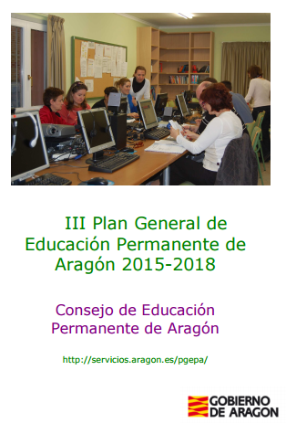

# 4.3. Plan General de Formación Permanente en Aragón.

## Actividad de lectura

La Ley 16/2002, de 28 de junio, en Aragón, determina que el Consejo de Educación Permanente de Aragón elabore cada cuatro años un Plan General de Educación Permanente para Aragón, y por este motivo se han redactado con anterioridad dos Planes Generales; en el momento actual se encuentra en vigor el III Plan General..

[**III Plan General de Educación Permanente de Aragón 2015-18**](http://www.educaragon.org/files/III_Plan_General_Educacion_Permanente_Aragon.pdf)

