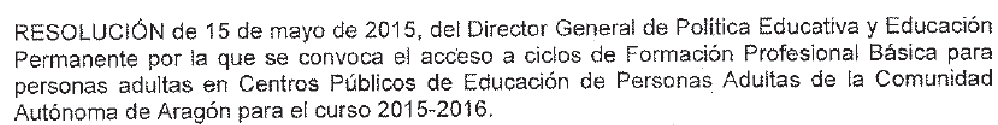

# 4.4. Ley Orgánica de las Cualificaciones y de la Formación Profesional

## Actividad de lectura

La Ley Orgánica 5/2002, de 19 de junio, de las Cualificaciones y de la Formación Profesional (BOE 20-06-2002) establece que los títulos de formación profesional y los certificados de profesionalidad constituirán las ofertas de formación profesional referidas al Catálogo de Cualificaciones Profesionales, que tienen carácter oficial y validez en todo el territorio nacional y serán expedidos por las Administraciones competentes.

Los Certificados de Profesionalidad acreditan con carácter oficial las competencias profesionales que capacitan para el desarrollo de una actividad [laboral](http://catedu.es/educacionpermanente/certificados_profesionalidad/) con significación para el empleo. Esta acreditación oficial certifica que la persona que lo posee tiene los conocimientos y las habilidades para desarrollar una actividad laboral determinada, es decir, está cualificada.

Un Certificado de Profesionalidad está constituido por “Unidades de Competencia”, que pueden adquirirse mediante la acreditación de la experiencia laboral o a través de la formación. En el sistema de formación estas “Unidades de Competencia” se adquieren mediante la superación de “Módulos Formativos”, constituidos por una o varias “Unidades Formativas”.

Los certificados de profesionalidad tienen una duración entre 290 y 800 horas de formación, incluida la formación en centros de trabajo.

La [**Resolución**** de 18 de noviembre de 2009** de la Directora General de Formación Profesional y Educación Permanente autoriza la impartición de Certificados de Profesionalidad en Centros de Educación de Personas Adultas de la Comunidad Autónoma de Aragón.](http://admin.educaragon.org/files/Resolucion_Modulos_Certificados_Profesionalidad.pdf)

La [**Resolución**** de 18 de octubre de 2011 **](http://adultosh.educa.aragon.es/normativa/archivos/Res_Autoriz_Instr_Certif_Prof_11_12.pdf)[del Director General de Política Educativa y Educación Permanente autoriza la impartición y se dictan instrucciones para la organización y funcionamiento de Certificados de profesionalidad en Centros Públicos de Educación de Personas Adultas de la Comunidad Autónoma de Aragón a partir del curso 2011-12. ](http://admin.educaragon.org/files/Resolucion_AUTORIZACION_Certificados_Profesionalidad-2011_FIRMADA-2.zip)

La Formación Profesional Básica para personas adultas se concreta en la siguiente resolución:

Puedes obtener más información sobre Formación Profesional Básica en el [siguiente enlace](http://www.educaragon.org/guiaeducativa/guia_educativa_permanente.asp?sepRuta=Sistema+Educativo%2F%3Ca+href%3D%27%2Feducacion%5Fno%5Funi%2Easp%27%3EEnse%F1anza+no+Universitaria%3C%2Fa%3E%2F&amp;guiaeducativa=&amp;strSeccion=PPI04&amp;titpadre=Educaci%F3n+permanente&amp;arrpadres=$Normativa&amp;arrides=$78&amp;arridesvin=$&amp;lngArbol=2488&amp;lngArbolvinculado=).

## Importante

Página imprescindible para conocer [Normativa](http://catedu.es/educacionpermanente/certificados_profesionalidad/normativa.html)** | **[Centros](http://catedu.es/educacionpermanente/certificados_profesionalidad/centros.php)** | **[Matrícula](http://catedu.es/educacionpermanente/certificados_profesionalidad/matricula.html)** | **[Requisitos de acceso](http://catedu.es/educacionpermanente/certificados_profesionalidad/requisitos_acceso.html) que regulan los Certificados de profesionalidad en CPEPAs de Aragón.

****Haz clic sobre la imagen para acceder.****

