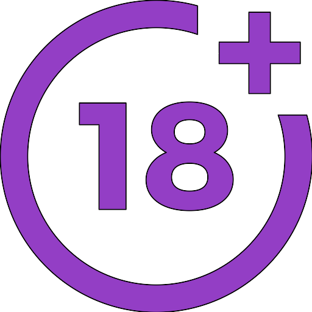

# Introducción

>**danger**
>Curo actualmente en revisión

Este curso va destinado al profesorado que se incorpora por primera vez al Programa de Educación de Personas Adultas en los diferentes ámbitos provinciales, ya sea personal funcionario, contratado de Entidades Locales o Asociaciones de iniciativa social.

Actualmente no existe una especialidad de maestro/a-profesor/a en educación de personas adultas, sin embargo se trata de un ámbito educativo diferenciado que requiere de una formación y tratamiento específico, por lo que es necesario plantear un curso de formación de entrada para el profesorado que se incorpora a este tipo de enseñanzas.

Los usuarios de esta formación, además de la titulación de entrada requerida y de una adecuada formación de carácter pedagógico, deberán adquirir estas competencias:

* Competencias psicopedagógicas y metodológicas necesarias para el desarrollo de programas de formación dirigidos a la población adulta, adaptados al entorno en el que se desarrollan: destinatarios, contexto socioeducativo, institucional y normativo.
* Competencias para diseñar, intervenir y evaluar programas dirigidos a la población adulta, desarrollando capacidades y destrezas específicas.

## MUY IMPORTANTE

**Las tareas de entrega obligatorias del curso deben ser trabajos individuales, no se admitirán tareas grupales o entregas claramente duplicadas. Las respuestas de las tareas deben ceñirse a responder al enunciado de las mismas.**

