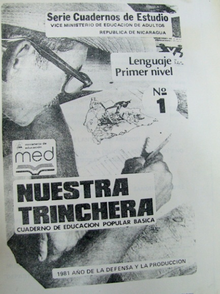
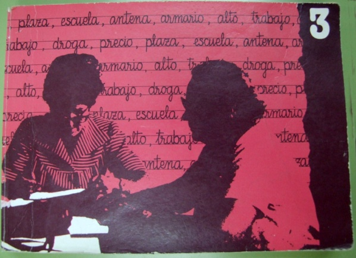
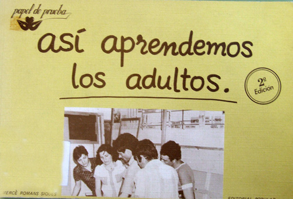
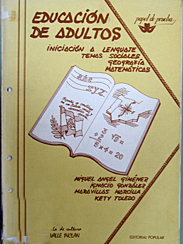
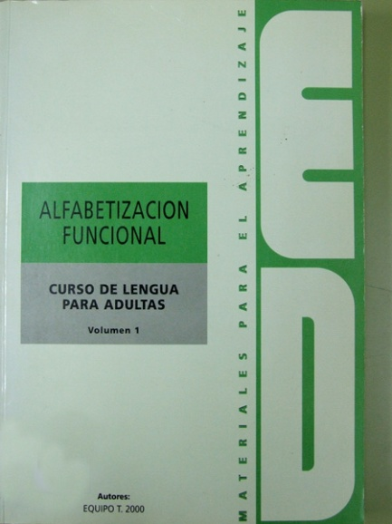
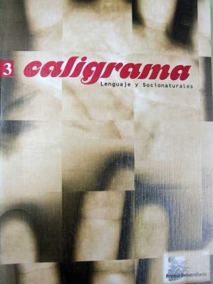
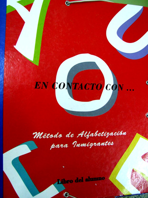
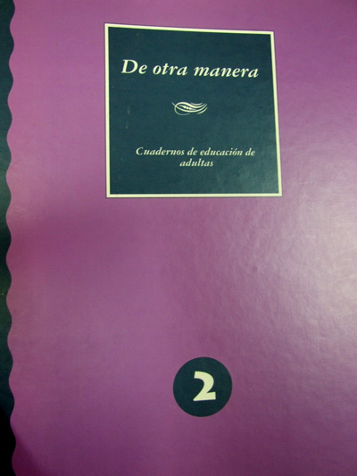
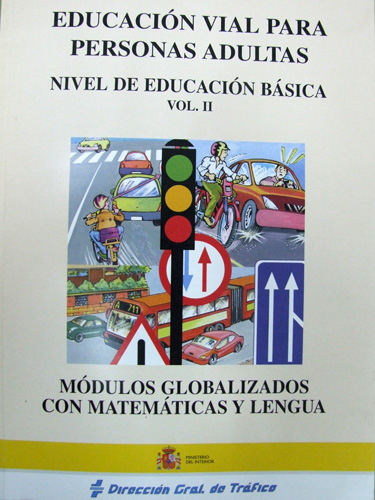

# Contenido

A finales de los años 70 se produce un movimiento de renovación pedagógica en Sudamérica ligado a las campañas de alfabetización. En Brasil, Paulo Freire vincula la alfabetización con el proceso de toma de conciencia de la realidad y la actuación para transformarla. Este movimiento pedagógico pretende que el adulto que se alfabetiza no sólo aprenda la mecánica de la lectoescritura sino que también la utilice como herramienta de transformación de su propia realidad. Freire contrapone el aprendizaje bancario con un aprendizaje que promueva el cambio. Como él mismo decía: “Jamás acepté que la práctica educativa debería limitarse sólo a la lectura de la palabra, a la lectura del texto, sino que debería incluir la lectura del contexto, la lectura del mundo.”

Desde el punto de vista de la práctica didáctica, Freire propone el método de la palabra generadora. El aprendizaje de una letra nueva se inicia con una palabra que suscita el diálogo, la reflexión. Este modelo es ampliamente seguido en otros países latinoamericanos.

 

La palabra	En España, a inicios de los 80 se está produciendo una transformación en la educación de adultos, especialmente en las barriadas populares de las grandes ciudades. Fruto de la experiencia docente, y dado que no existe ningún material específico de alfabetización que responda a las nuevas expectativas, la editorial El Roure publica en 1.982 un nuevo método que recoge algunas de las premisas de Paulo Freire en especial la metodología basada en la palabra generadora.  El método “La palabra” supone también un cambio en el aspecto, modificando el estilo de las ilustraciones, la tipografía y el formato del libro, asumiendo que los materiales para adultos deben tener una estética diferente. No hay que olvidar que hasta entonces era frecuente en las clases de alfabetización  la utilización de las denominadas “cartillas escolares” dirigidas al alumnado infantil.

En esos momentos ya se intuía que las grandes editoriales escolares no estaban interesadas en este “reducido mercado” educativo. En su lugar pequeñas editoriales, frecuentemente vinculadas a equipos docentes y asociaciones afrontan el reto de producir materiales acordes con las nuevas tendencias. La editorial Popular, publica en 1.985 “Así aprendemos los adultos”, siguiendo la iniciativa del método “La palabra”.

Los Certificados de escolaridad articulan, por aquel entonces,  la oferta de enseñanzas iniciales, así como la preparación para el Graduado Escolar que entonces está vigente como escolarización básica. Además ,en los centros comienzan a crearse grupos que  atienden a neolectores y se percibe la necesidad de materiales específicos para ellos. En esta línea, también es la editorial Popular la que publica diversos materiales dentro de la línea editorial denominada “Papel de prueba” en el que se abordan temas como el aprendizaje de las matemáticas, la alfabetización en el medio penitenciario, la formación ocupacional, los derechos de la mujer, etc.

A los Centros de adultos acuden personas que desean consolidar aprendizajes adquiridos en el pasado e incluso ir preparándose  para acometer niveles académicos superiores, estos grupos motivan la creación de materiales  para aquellos que superan los niveles más básicos de las enseñanzas iniciales. El análisis de estos materiales muestra por una parte la incipiente tendencia  de adaptar los contenidos al mundo adulto, aunque a veces todavía bajo el sistema clásico disciplinar, pero por otra parte comienza a generalizarse un planteamiento metodológico en el que la globalización de los contenidos y la organización por Centros de interés marca la estructuración de contenidos y actividades.

Grupos de profesores dedicados al trabajo con adultos en enseñanzas iniciales elaboran diversos materiales que no llegan a los canales de distribución comercial, y que en algunos casos cuentan con el apoyo de unidades de programas provinciales o autonómicas. Son materiales que desde Burgos, Murcia, Andalucía,etc, se difunden en jornadas pedagógicas  y encuentros de profesores  por medio de copias artesanales.

Conceptos nuevos por aquel entonces, como alfabetización funcional y analfabeto de retorno inspiran algunas obras que presentan una forma peculiar de trabajo con el alumno adulto, siempre bajo el prisma de renovación y eficacia. Es el caso del “Curso de lengua para adultas” creado por el equipo T 2000 y publicado en 1.992.

Nuevamente será la editorial El Roure la que intenta una renovación en los materiales de alfabetización con el método Lola. Dividido en dos volúmenes,  incorpora además dos libros exclusivamente de lectura, integrado con el libro de actividades. Quizá la novedad estriba en que las lecturas, graduadas al tiempo que se van produciendo los aprendizajes de lectoescritura, presentan un hilo de continuidad de la mano de los personajes que aparecen en el libro. Siempre fieles a sus orígenes, muestra personajes y realidades de los barrios populares de las ciudades.

La expansión de la Educación de Adultos propicia la incorporación de nuevas editoriales. Prensa Universitaria desarrolla una colección de cuadernos de trabajo: Caligrama y Diagrama son sus títulos publicados en 1.998, y buscan dar un apoyo en los tramos finales de las enseñanzas iniciales.

La realidad social española sufre un radical cambio con la aparición de inmigrantes extranjeros. Los centros de educación de adultos asumen desde el principio la tarea de la enseñar el castellano a estos nuevos alumnos. Al mismo tiempo queda patente una nueva necesidad: muchos inmigrantes desconocen nuestra grafía, e incluso muchos de ellos son analfabetos en su origen. Además, junto a los aspectos de aprendizaje instrumental, los enfoques interculturales impregnan las actividades de todo el alumnado de los centros de adultos. Este nuevo reto implica una nueva generación de materiales específicamente dedicados al alumnado extranjero.

El Ministerio de Educación en colaboración con la FAEA y el CODEF publican en 1.998 el método de alfabetización e inserción cultural “Contrastes” cuyo destinatario son inmigrantes extranjeros. Igualmente, la fundación Santa María publica en 2.001  el método “En contacto con…” ,presentado como método de alfabetización para Inmigrantes.

El índice de analfabetismo femenino estadísticamente es mayor que el masculino, y este desequilibrio se mantiene en niveles superiores. Para acabar con esta diferencia El Ministerio de Educación junto con el Instituto de la Mujer publican en 1.992 con gran profusión de medios el método “De otra manera” que abarca desde la alfabetización hasta el final de las enseñanzas iniciales. Quizá lo más significativo de este material es que aporta un rico y variado banco de recursos sobre temas de especial interés, aunque no exclusivo, para la mujer. Adopta una metodología fundada en los centros de interés y en las tareas colaborativas.

También con un criterio de organización fundamentado en los centros de interés y los aprendizajes funcionales y significativos el Ministerio de Educación publica en 1.994  la colección de cuadernos de trabajo titulada “Vivo y aprendo”.

En línea con  contenidos específicos agrupados por centros de interés, la editorial Nau Llibres publica en 2001 un material para neolectores titulado “Un día cualquiera” material surgido, como tantos otros, de la actuación directa del profesorado en los centros de adultos, en este caso el denominado Grupo Sis, y motivados a difundir sus experiencias a través de la aventura editorial.

Uno de los factores motivadores para el aprendizaje de las técnicas instrumentales básicas de lectura y escritura fue el acceso al Permiso de conducir. Intentando unir esta motivación con el decidido intento de difundir la educación vial entre la población adulta, la Dirección General de Tráfico inició una serie de publicaciones que abarcaron desde la superación de dificultades de comprensión oral y comprensión lectora, hasta la incorporación de los temas de Educación vial en la formación básica, siguiendo un criterio metodológico globalizador.

