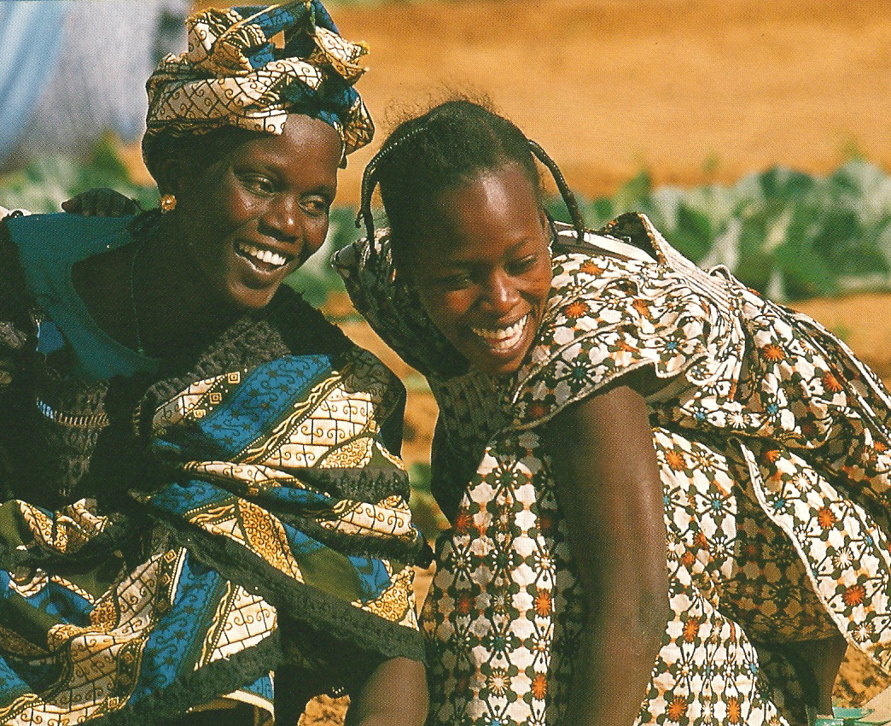
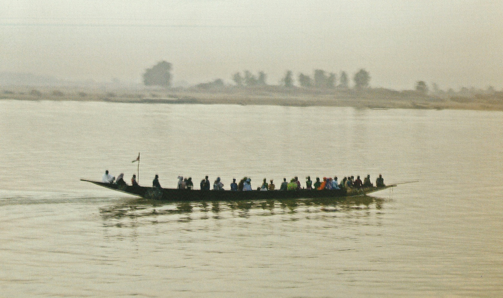
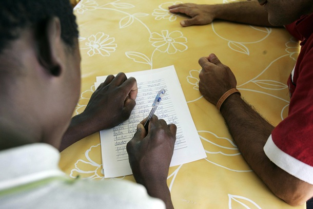
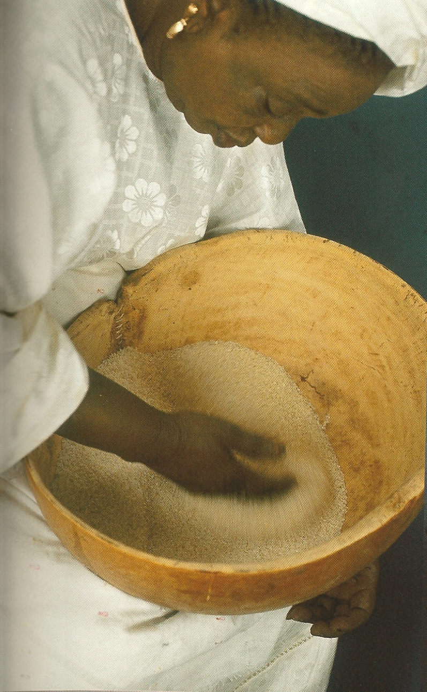

# Contenidos

**La historia de Khalia y Mombo**

Khalia era una de las mujeres más guapas e inteligentes de su comunidad: conocía todas las reglas, sabía desenvolverse extraordinariamente bien en todas las facetas de la vida, curaba algunos males, cocinaba bien, estaba al tanto de las noticias relevantes, era alegre, bailaba, llevaba trajes elegantes que cosía ella misma... **Khalia era muy querida por todos y tenía mil apodos: Khalia la lista, Khalia la bella, Khalia la sonriente, Khalia la amable, Khalia la ocurrente...**

<td style="text-align: center;">Abella, T. (2005): M de Mujer.  Barcelona. Intermón Oxfam.</td>

Muchos jóvenes de su comunidad la pretendían. Pero ella sabía, desde hacía mucho tiempo, que sólo aceptaría a Mombo. Mombo, el más audaz de la comunidad, el más avanzado y el más lúcido, fue sensible a las sonrisas que Khalia le dedicaba, sensible a la inteligencia de Khalia y sensible a la brillantez, actividad y entusiasmo de esa mujer. Y, por todo ello, la pidió en matrimonio.

Khalia y Mombo eran una fuerza vital: juntos producían más que nadie, se reían más que nadie, vibraban más que nadie y eran profundos conocedores de las tradiciones del pasado y actores principales del futuro.

Pero las cosas se pusieron mal en su país cuando nació el primero de sus hijos, Tron, y Mombo, el audaz, emprendió un difícil camino hacia otra parte. Khalia lo amaba y lo siguió con Tron.

En cuestión de horas, difíciles horas, por otra parte, Khalia, Mombo y Tron han sido despojados de todos sus atributos. Están rodeados de personas que hablan otro idioma, se mueven de otra manera, hacen cosas incomprensibles, están en la calle en ciertos momentos para dejarla vacía en otros, hay días que lo cierran todo, todo está lleno de extraños símbolos, a veces fijos, a veces intermitentes, manejan unas monedas extrañas y acuden a lugares que no parecen accesibles, mueven las manos de maneras diferentes, hacen gestos extraños, colocan las cosas en sitios distintos, hablan desde muy lejos.

<td style="text-align: center;">Pons-Föllmi, D. y Föllmi, O. (2006): Orígenes. 365 pensamientos de maestros africanos. Barcelona. Lunwerg</td>

En cuestión de horas Khalia ya no es la misma: no conoce las reglas, no sabe comprar, no encuentra alimentos que conoce y los que encuentra no sabe cómo cocinarlos, no puede explicar su historia, no ve en el campo las hierbas que curan el dolor de estómago, no sabe qué pasa en la comunidad, sus vistosos vestidos –los tres que puso en el macuto- no le sirven para el frío y no sabe cómo vestirse, mira a Tron y piensa que no puede enfermar, que ella no sabe a quién acudir… Y, sobre todo, Khalia ha dejado de cantar y ya no sonríe.

Mombo también está como Khalia, víctimas ambos del desconcierto y la extrañeza, pero, por suerte, él ha encontrado a un primo tercero que le ha ofrecido un trabajo en el campo. Mombo sale de casa y pasa el día trabajando con los amigos de su primo, todos del mismo país. Sólo uno de ellos habla con el jefe una lengua que Mombo no conoce, luego su primo se lo traduce por encima. Él sabe que se lo ha traducido por encima, sólo por encima... Mombo ya no domina la situación. Al contrario, la situación lo domina a él. También domina a Khalia. Ya no son Mombo y Khalia, ya no tienen mil apodos, ya no son audaces, ni bellos, ni… Sólo tienen uno: son  inmigrantes y, “a lo peor”, dos: son inmigrantes africanos.

En medio de ese mundo que no saben cómo interpretar encuentran a una serie de personas bienintencionadas: les dicen a Khalia y a Mombo que Tron tiene que ir a la escuela, y que Khalia también tiene que ir. Mombo, además, podría dedicar unas horas a ir a un Centro de Adultos. Les irá bien.

Los bienintencionados se reúnen entre sí y dicen que quieren ayudar a Khalia y a Mombo y que quieren enseñarles su lengua para que Khalia Y Mombo estén mejor. Los bienintencionados empiezan sus clases. No son especialistas, no lo han hecho nunca, pero piensan que, por poco que hagan, les servirá. Un tiempo después los bienintencionados se reúnen y comentan que tienen una serie de problemas. Khalia y Mombo no avanzan porque: no saben leer y escribir, no entienden lo que les dicen, no acuden a clase regularmente, no salen mucho de casa y no se integran, no consiguen avanzar lo suficiente, no se dan cuenta de lo importante que es acudir a sus clases, no entienden la puntualidad, la regularidad. Además, se compran teles, que no les sirven para nada, y se pasan el día viendo programas absurdos… No, no, no...

Los bienintencionados están preocupados. Muchos de ellos están ayudando a Khalia y a Mombo como voluntarios, otros porque en su centro se ha hecho necesario dedicarse a los inmigrantes. Pero nadie les ha dado recursos ni técnicas para poder llevar a cabo su trabajo… Sí, los bienintencionados están muy preocupados y más cuanto más conocen a Khalia y Mombo porque ven que no siempre les ofrecen los que necesitan…

Pero los bienintencionados están desbordados por sus horarios, por sus múltiples obligaciones, por todo, pero las instituciones no se ocupan lo suficiente de ellos, no les dan la formación adecuada, sólo simulacros de cursos para salir del paso, si es que se sale…

Los primeros días de clase Khalia y Mombo, en dos clases distintas, se encontraron por primera vez en su vida con un papel y un lápiz y tenían que hacer unos dibujos como soles con un palito a la derecha, que luego se juntaban con otros palos que eran como montañas y todo el rato tenían que dibujar esa cosa absurda. Ellos lo hacían sin entender el porqué, pero, sobre todo, para complacer a aquellos bienintencionados que parecían valorar mucha aquello.

Los bienintencionados les daban explicaciones, que ellos no entendían: es importante –les decían- es importante para hablar. Tú haces redondas y montañitas y cuando hayas hecho muchas, tantas como las montañas que están en el horizonte de tu casa, podrás hablar nuestra lengua. Khalia y Mombo no entendían aquellas palabras pero tampoco entendían que tuvieran que dibujar cuando ellos lo que querían era hablar esa lengua que hablaban sus hermanos, los bienintencionados. En su comunidad, habían aprendido a hablar sin hacer soles ni montañas, nadie nunca había hecho montañas pero todos hablaban muy bien y lograban decir todo lo que querían: hablaban del pasado y del futuro, se amaban y se regañaban, compraban, reivindicaban, matizaban, agradecían...

Khalia y Mombo algún día no van a clase. Vivir es difícil. Hay que salir a unas calles que no conocen, a unas tiendas extrañas que deben recorrer mucho rato para no siempre encontrar lo que buscan, hay que cocinar, hay que... Mombo llega destrozado del campo y Khalia está agotada. Están cansados, tensos, con ese agotamiento de vivir entre desconocidos, con reglas opacas y amenazantes, con esa angustia de vivir en un lugar en el que ningún ruido es conocido, no hay ningún fragmento de conversación que entiendas por la calle, ningún signo que interpretar, ningún lugar familiar, no hostil, donde relajarse. Por eso, muchos días, ir a clase es imposible y es mejor quedarse en casa o ver a una prima quinta que vive más arriba y hablar de sus cosas y cantar sus canciones. Además, no pasa nada si un día no haces soles y montañas.

<td style="text-align: center;">[http://www.diariodeavisos.com/gobierno-adeuda-21-millones-euros-por-menores-inmigrantes/](http://www.diariodeavisos.com/gobierno-adeuda-21-millones-euros-por-menores-inmigrantes/)</td>

Tampoco entendieron cuando otro día en una clase cantaron una extraña canción que decía: "trabajo, trabajas, trabaja, trabajamos, trabajáis, trabajan" que tenía una segunda estrofa que decía "aprendo, aprendes, aprende, aprendemos, aprendéis..." Qué música tan distinta a la suya. Además, la tenían que cantar muy quietos, sin moverse, sentados, en la mano el lápiz de los soles y el papel de las montañas.

Khalia, en la calle de sonidos inescrutables, había ido escuchado algunas cosas. Observó que, en el mercado, todas las mujeres decían: "Quería...”, “quería...", “quería...".  y un día decidió decirlo. Dijo: "Quería...” y señalaba con el dedo la verdura que cocinaría por la noche. Otro día observó que al final de la compra las mujeres decían: "¿Cuánto es?" y lo dijo. Estaba contenta, había empezado a usar las palabras de los otros y aquello funcionaba.

Mombo aprendía otras cosas y por las noches se las enseñaban mutuamente: juntos habían aprendido cómo funcionaba el dinero y reconocían ya todas las monedas y billetes y habían calculado cuánto tenían que gastar en cada cosa.

Como tenían un poco de dinero extra, decidieron comprarse una tele. Mombo esa tarde fue a clase y le dijeron que había tres tipos de verbos, algo que no entendió porque no sabía si el verbo era un vegetal o un animal, pero dedujo que el verbo a él no le interesaba en absoluto. Después dibujó una serie de montañitas pequeñas junto a un palo que subía, se cruzaba y bajaba, como el palo de un barco junto a una pequeña ola del mar. Por suerte, al salir de la clase, fue a una tienda con un primo suyo y usó lo que Khalia le había contado. Dijo: "Quería..., ¿cuánto es?”, y “muchas gracias", que es lo primero que aprendió a decir.

El televisor fue una pequeña epifanía para Khalia y Mombo. Era entretenido, distraído pero, además, podían observar cómo hablaba aquella gente sin estar presionados por la situación, con calma, mirando fijamente con los oídos bien abiertos. Los concursos les sirvieron para aprender cómo se hablaba de dinero; los anuncios para aprender el nombre de algunas cosas; las series para aprender despedidas, saludos, cosas que se dicen a los niños… Khalia y Mombo iban observando la lengua, fijándose ahora en unas cosas y luego en otras, pensando en para qué servían y, así, cuando estaban seguros de sus hipótesis, las usaban en la calle. Khalia aprendió a cocinar algunas comidas nuevas y ya sabía comprar muchos productos alimenticios gracias a un señor con bigote muy simpático que salía en la tele.

Los bienintencionados seguían haciendo innumerables reuniones para ver cómo conseguir que gente como Khalia y Mombo fueran regularmente a las clases. Khalia y Mombo iban de vez en cuando para no hacerles un desaire, porque les tenían aprecio y porque allí encontraban a gente como ellos. Cuando llegaban, saludaban a su sonriente bienintencionado profesor que se sentía satisfecho al comprobar que Khalia había dicho “Hola, buenas tardes, ¿qué tal?” y Mombo al despedirse le había dicho: “Hasta el lunes. Buen fin de semana”, lo que probaba los beneficios de estar en clase y eso que sólo habían hecho los presentes de indicativo regulares.

De vez en cuando, su amable y bienintencionado profesor iba a visitarlos a sus casas. Ellos le ofrecían té y algún fruto seco. Era simpático, pero resultaba sorprendente que ellos nunca fueran a su casa. En el poblado, si alguien toma té en tu casa, te invita luego a la suya. Khalia y Mombo llegaron a la conclusión de que aquí los profesores tenían la potestad de ir a casa de los estudiantes por sorpresa.

Los bienintencionados profesores también organizaban domingos festivos en los que Mombo, Khalia y otros inmigrantes tenían que cocinar y cocinar platos tradicionales que luego comían conjuntamente. Los bienintencionados profesores estaban muy contentos y comían y comían. Parece ser que su propia comida no les gustaba mucho porque nunca la cocinaban ni la llevaban a esos encuentros y comían sin parar la que habían preparado Khalia y sus primas.

<td style="text-align: center;">N’Dour, Y. y Rozenbaum, I. (2004): **Senegal. La cocina de mi madre.** Barcelona. Intermón Oxfam. Pg. 39.</td>

De repente, un día, las calles se llenan de luces y de gente. A la gente parece no importarle el frío, salen a la calle y se pasan el día comprando mientras se oyen canciones por las calles. Khalia no entiende qué pasa, pero prefiere estas luces y vivir en una ciudad con música por todas partes. No sabe por qué todo el mundo está comprando y comprando y piensa que a ella también le gustaría poder hacerlo. En el mercado y en el supermercado hay comidas nuevas. Khalia mira unas cajas que tienen el dibujo de unas barras marrones o blancas con almendras, pero no sabe cómo se cocinan ni cuándo se comen. También hay algo redondo envuelto en papel de celofán de diversos colores pero no sabe qué hacer con eso. Un día no hay nadie por las calles, nadie paseando, nadie cantando en el exterior. Ese día Mombo tiene fiesta y pasean los tres por las calles solitarias que siguen llenas de luces. Están extrañados y un poco asustados, parece que haya pasado algo grave. Mala señal, cuando no hay nadie en la calle, sobre todo teniendo en cuenta que últimamente en la ciudad parecía haber más gente que antes.Lo que Khalia y Mombo no sabían es que ese día los bienintencionados comían cordero o pavo o col lombarda con sus familias y tomaban barras de turrón de postre. Los bienintencionados tuvieron una reunión unos veinte días antes y llegaron a la conclusión de que no iban a hablar de la Navidad en sus clases porque era una fiesta católica y sus estudiantes tenían otras religiones. No querían imponer la religión católica, como es natural. Tron, Khalia y Mombo nunca supieron por qué, varios días después, los niños salían de sus casas llenos de juguetes. Tron fue el único niño de su escalera que no tuvo juguetes el 6 de enero.

Un día, ya en primavera, Khalia y Mombo tienen que ir a un parque donde hay unas casetas. Les han pedido que lleven su comida y su música. Mejor si se visten con sus trajes africanos. Khalia cocina otra vez y Mombo sale del trabajo con la lengua fuera para poder ir a casa a cambiarse y luego acercarse a esas casetas llenas de luces. Ese día toda la gente se acerca a verlos, les sonríen, comen un poco de su comida, les dan golpecitos en la espalda y le hacen caricias a su hijo. Khalia y Mombo se ilusionan. Igual podrán empezar a tener amigos. Pero el día termina y al día siguiente todo sigue como antes: Khalia en casa o vagando por el supermercado, que es donde no tiene que hablar, y Mombo trabajando y hablando su lengua con sus compatriotas. Los bienintencionados dicen que el “día de la integración” o el “día contra el racismo” o el “día del inmigrante” ha sido un éxito. Había mucha gente, pasó un montón de gente por la caseta, comieron y bailaron. Los bienintencionados, satisfechos esta vez, ya están pensando cómo organizarlo otra vez al año siguiente. Trescientos sesenta y cuatro días para pensar. Trescientos sesenta y cuatro días más de soledad para Khalia y Mombo.

****En: Miquel, L. (2003): “Consideraciones sobre la enseñanza de español lengua extranjera a inmigrantes”. En Revista Carabela, nº 53, pp. 5-24. Madrid. SGEL.****  
