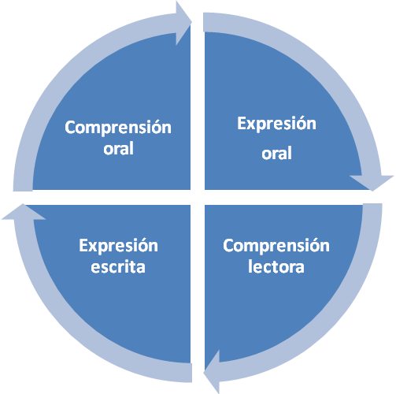

# Contenidos

## Importante

**Introducción**

Cuando utilizamos la lengua, podemos activar cuatro destrezas lingüísticas básicas: ****comprensión oral, expresión oral, comprensión lectora y expresión escrita.**** Algunos autores señalan también la **interacción oral** como una destreza diferenciada pues supone el dominio de la comprensión y expresión oral de forma indisociable.

En los programas y manuales de enseñanza de segundas lenguas, era habitual encontrar un tratamiento diferenciado de cada destreza y actividades aisladas para cada una. No obstante, en la actualidad, se tiende a su integración. Hay que tener en cuenta que en la vida real la mayor parte de las situaciones comunicativas con las que nos encontramos integran, si no todas las destrezas, al menos las de carácter oral, al ser la conversación el acto comunicativo más frecuente en nuestras vidas.

Aunque nosotros también proponemos un tratamiento integrado de las destrezas en el aula, conviene analizarlas por separado, saber en qué consiste exactamente cada destreza, qué habilidades o microdestrezas se encuentran implicadas y cómo debemos plantearnos su enseñanza.

 

## Contenidos

3.1. La comprensión oral.

3.2. La expresión oral.

3.3. La comprensión escrita.

3.4. La expresión escrita.

3.5. Actividades para favorecer el aprendizaje de la lectoescritura.
