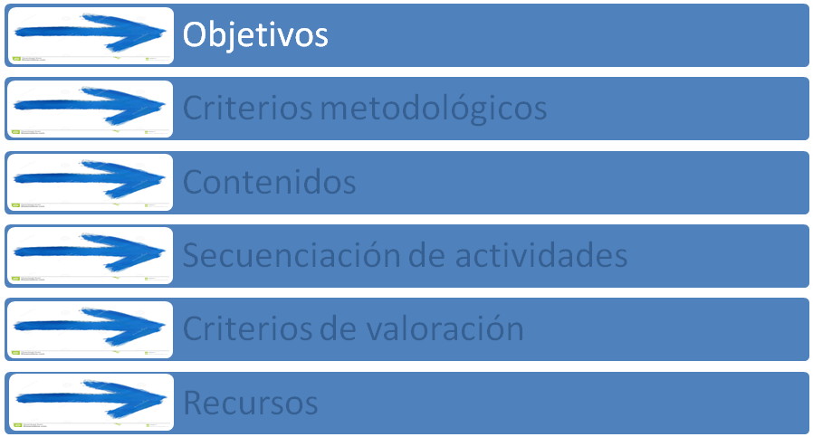

# Contenidos

**Objetivos del curso**

Estamos llegando al final del Módulo y, como verás, son varios los temas que todavía sería interesante tratar. Quizá en estos momentos puedas tener más dudas que respuestas. Sí es así, también lo valoramos como positivo, de alguna manera, ese ha sido nuestro propósito: aportar unas orientaciones básicas —básicas pero no simples, ni superficiales— que despertasen inquietudes y ganas de continuar investigando.

No obstante, antes de finalizar, vamos a asomarnos a una cuestión relevante: Se trata quizá de la primera pregunta que nos hacemos cuando planificamos una intervención educativa. Sí, estamos hablando de **objetivos**. Ha llegado el momento de tratar de responder a esta cuestión:

**¿Qué objetivos tendrán los cursos de español? **

A la hora de planificar los cursos, debemos reflexionar sobre sus objetivos. Para ello, conviene revisar algunos instrumentos con los que el educador/a debe estar necesariamente familiarizado. Estos instrumentos se encuadran dentro de los siguientes marcos:

4.1.Marco de la enseñanza del español como segunda lengua.

4.2. Marco normativo de la Educación de Personas Adultas.
