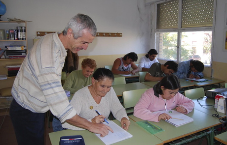

# M4. Competencias Clave y acceso a FP

## **Introducción**

¿Cómo se organizan las enseñanzas de Educación Secundaria para Personas Adultas \(ESPA\)? ¿Qué requisitos deben cumplir las personas que se matriculan en los cursos de preparación a las pruebas de acceso a Ciclos Formativos? ¿Qué tipo de alumnado me voy a encontrar en las aulas?

El estudio de este módulo te permitirá responder a estas y otras preguntas.

## Objetivos

* Conocer la legislación y normativa referida a las enseñanzas de ESPA y de los cursos de preparación a las pruebas de acceso a Ciclos Formativos.
* Familiarizarse con el perfil del alumnado que cursa estas enseñanzas.
* Saber cómo se organizan estas enseñanzas.
* Reflexionar sobre determinados aspectos de estas enseñanzas.
* Conocer la legislación y normativa referida a los Módulos formativos N-2 para diseñar planes de actuación concreta.

## Actividad de lectura

Este módulo contiene dos partes diferenciadas:

**Unidad 1: La Educación Secundaria para Personas Adultas \(ESPA\). **

1.1. Concepto de adaptación.

1.2. Perfil sociológico del alumnado.

1.3. Organización de las enseñanzas.

1.4. Un curriculum basado en competencias.

1.5. Instrumentos de evaluación.

1.6. Modalidades formativas

**Unidad 2: Los cursos de preparación para el acceso a los Ciclos Formativos de Grado Medio y Grado Superior.**

2.1. Normativa reguladora.

2.2. Modalidades.

2.3. Perfil de los participantes.

2.4. El futuro próximo.

\(Tiempo de dedicación estimado: **10 horas**\).

