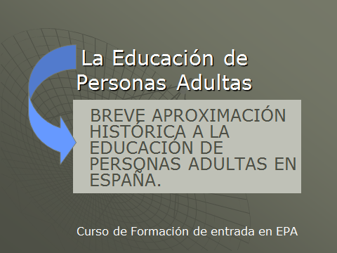
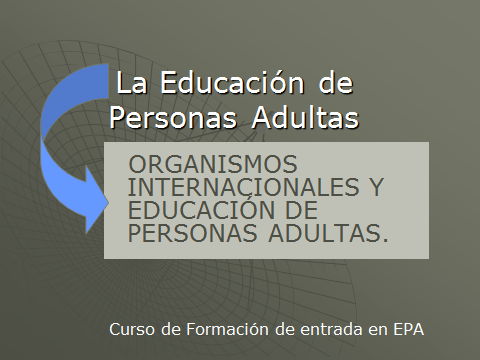

# Resumen

## Curiosidad 

En las siguiente presentación puedes repasar de modo rápido los principales conceptos tratados en el punto uno de la unidad. Haz clic sobre la imagen.

 

## Curiosidad 

En la siguiente presentación puedes repasar de modo rápido los principales conceptos tratados en el punto segundo de la unidad. Haz clic sobre la imagen.

 

# Resumen

Como síntesis de la unidad, y recordatorio de algunos aspectos fundamentales, puedes ver la siguiente presentación. Haz clic sobre la imagen.

 

## Para saber más

Aunque la FIPA no se ciñe exclusivamente a la alfabetización, sí que éste es una fase fundamental de la misma. El concepto mismo de alfabetización ha evolucionado y en este momento debe afrontar nuevos retos. El texto que te proponemos en el siguiente enlace esboza una definición actual de la tarea de alfabetización.

Alfabetización funcional:

- [http://www.revistaeducacion.mec.es/re338/re338_17.pdf](616c6661626574697a616369c3b36e5f66756e63696f6e616c.pdf)

 

En el siguiente artículo de 2011 vemos en números la realidad española de la población analfabeta.

- [Enlace](http://www.rtve.es/noticias/20110908/mas-840000-analfabetos-viven-espanade-casi-70-son-mujeres/460187.shtml)  

 

Por último te proponemos la visión de este pequeño reportaje de televisión cuyo protagonista es la formación inicial de personas adultas y plantea cuestiones que más adelante veremos en los siguientes módulos.

- [Enlace](http://www.rtve.es/alacarta/videos/programa/alfabetizacion-de-adultos/894847/)
<td style="text-align: center;"> <object data="flowPlayer.swf" height="407" id="flowplayer" type="application/x-shockwave-flash" width="500"><param name="data" value="flowPlayer.swf"/><param name="flashvars" value="config={ 'playlist': [ { 'url': 'alfaadultos.flv', 'autoPlay': false, 'autoBuffering': true } ] }"/><param name="allowfullscreen" value="true"/><param name="allowscriptaccess" value="true"/><param name="exe_flv" value="alfaadultos.flv"/><param name="src" value="../templates/flowPlayer.swf"/></object></td>
<td style="text-align: center;">**Alfabetización de adultos en [RTVE A la Carta](http://www.rtve.es/alacarta/videos/programa/alfabetizacion-de-adultos/894847/)**</td>

 

