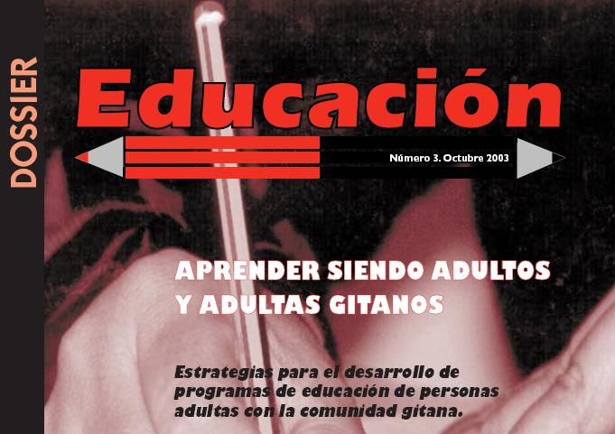

# Resumen

En esta unidad hemos esbozado la heterogeneidad de las personas que integran los grupos de enseñanzas iniciales, la importancia de partir de sus propias experiencias como punto de inicio para nuevos aprendizajes, de la necesidad de conocer  sus características, limitaciones e intereses  para  así incorporarlos a la tarea cotidiana educativa.

>**tip**
>## Para saber más
>
>Un concepto a considerar en el aprendizaje adulto es la denominada Inteligencia cristalizada. Te invitamos a que indagues en Internet sobre esta teoría de la inteligencia y reflexiones sobre las repercusiones que tiene en el aprendizaje de la persona adulta.
>
>La Fundación Secretariado General Gitano dispone de la web [https://www.gitanos.org/](https://www.gitanos.org/) que te puede aportar una visión desde dentro de esta cultura. Es interesante además su centro de documentación electrónico. Entre los documentos te seleccionamos éste:
>
>
>
>* [http://www.gitanos.org/upload/18/89/21Dossier.pdf](http://www.gitanos.org/upload/18/89/21Dossier.pdf)
>
>del que destacamos los capítulos dedicados a los objetivos y la metodología.
>
>Otra realidad de la formación inicial es la que se imparte en los Centros Penitenciarios. El siguiente enlace te dirige a un blog, vinculado al CPEPA Isabel de Segura de Teruel,  con interesantes experiencias y materiales, útiles tanto para población reclusa como para población no reclusa.
>
>[http://educarentrerejas.blogspot.com.es](http://educarentrerejas.blogspot.com.es/)
