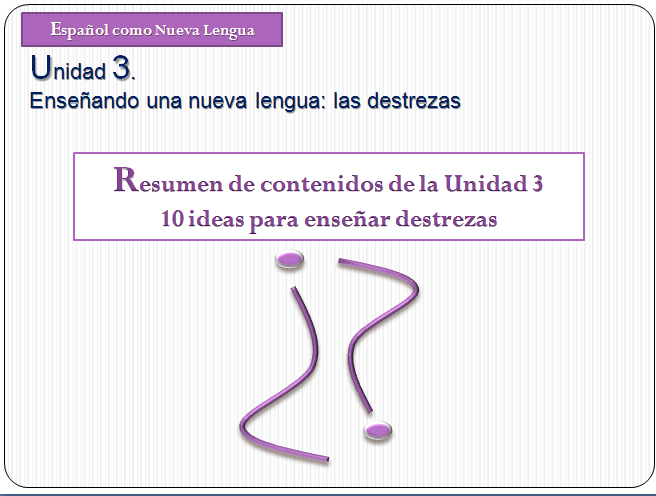

# Resumen

## Curiosidad 

En la siguiente presentación encontrarás un resumen de contenidos de la segunda unidad. Haz clic sobre la imagen.

## Para saber más

**Documentos para descargar**

Puedes ampliar la información sobre cada una de las destrezas lingüísticas consultando los siguientes artículos:

[BARALO, M. (2000): “El desarrollo de la expresión oral en el aula de E/LE”, en Carabela, 47, pp. 5-36. ](Baralo_expresion_oral.pdf)

[CASSANY, D. (1990): "Enfoques didácticos para la enseñanza de la expresión escrita", en **Comunicación, Lenguaje y Educación,** 6, 63-80. Madrid.](Cassany_Expresion_escrita.pdf)

[MARTÍN PERIS, E. (1991): "La didáctica de la comprensión auditiva", en Cable, 8, pp. 16-26.](Martin_Peris_Didactica_comprension-auditiva.pdf)

[MENDOZA, A. (1998): "El proceso de recepción lectora", en A. Mendoza (Coord.), **Conceptos clave en didáctica de la lengua y la literatura**. Barcelona: Horsori.](Mendoza_Recepcion_lectora_(1).pdf)

## Para saber más

**Recursos on-line**

Youtube dispone de varios canales especializados en la enseñanza del Español como Lengua Extranjera. Un ejemplo es [TodoELE](https://www.youtube.com/user/todoelecanal), en él encontrarás videoconferencias sobre distintos temas de interés para la formación del profesorado y materiales para el aula.

https//www.youtube.com/watch?v=ds-xxtdpC6E
<td style="text-align: center;">[Presentación de Paz Bartolomé](https://www.youtube.com/watch?v=ds-xxtdpC6E). Licencia Reconocimiento de Creative Commons</td>
