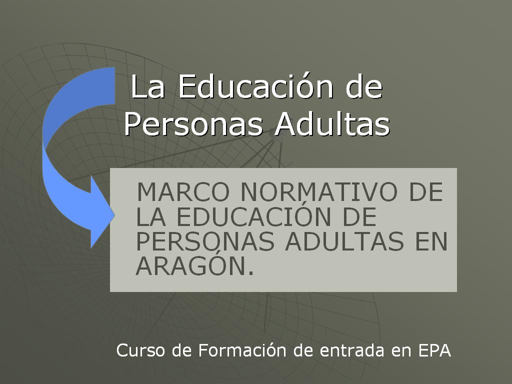
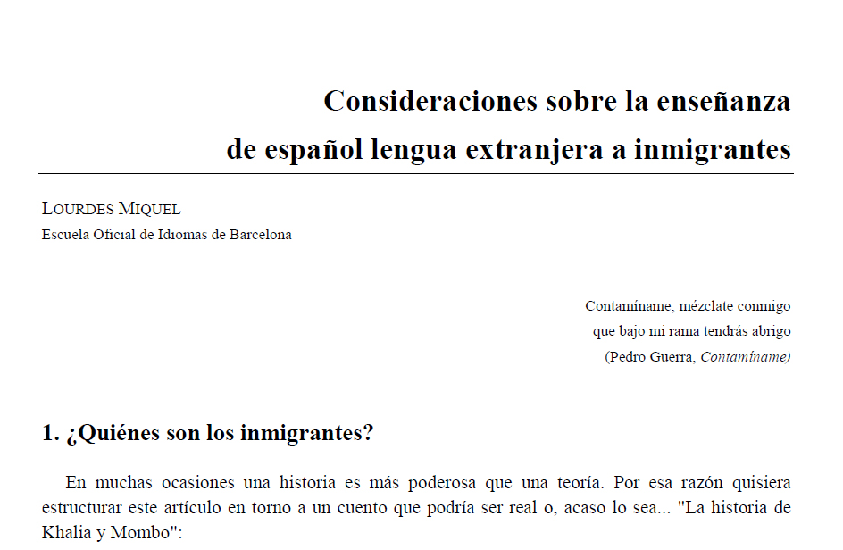

# Resumen

## Curiosidad 

En la siguiente presentación puedes repasar de modo rápido los principales conceptos tratados en esta Unidad; haz clñic sobre la imagen.

# Resumen

## Curiosidad 

En la siguiente presentación encontrarás un resumen de contenidos de la primera unidad. Haz clic sobre la imagen.

 

 

## Para saber más: documento para descargar

¿Quieres conocer el resto del artículo en el que aparece la “Historia de Khalia y Mombo”? Su autora, Lourdes Miquel, es una experta reconocida en la didáctica del español como lengua extranjera. Su mirada es relevante y de especial interés. En el artículo, analiza por partes la historia, introduce reflexiones y ofrece pautas muy prácticas para los docentes. Accede al documento haciendo clic en la imagen.

## Para saber más: recurso on-line

En la **Historia de Khalia y Mombo** se vislumbran varios temas vinculados al aula, como el duelo migratorio. En esta interesante entrevista, realizada por Montse Tejera, puedes ver a los especialistas Joseba Achotegui y Jorge Soler tratar sobre ello.

 

https//www.youtube.com/watch?v=RxvRdIX3C3k
