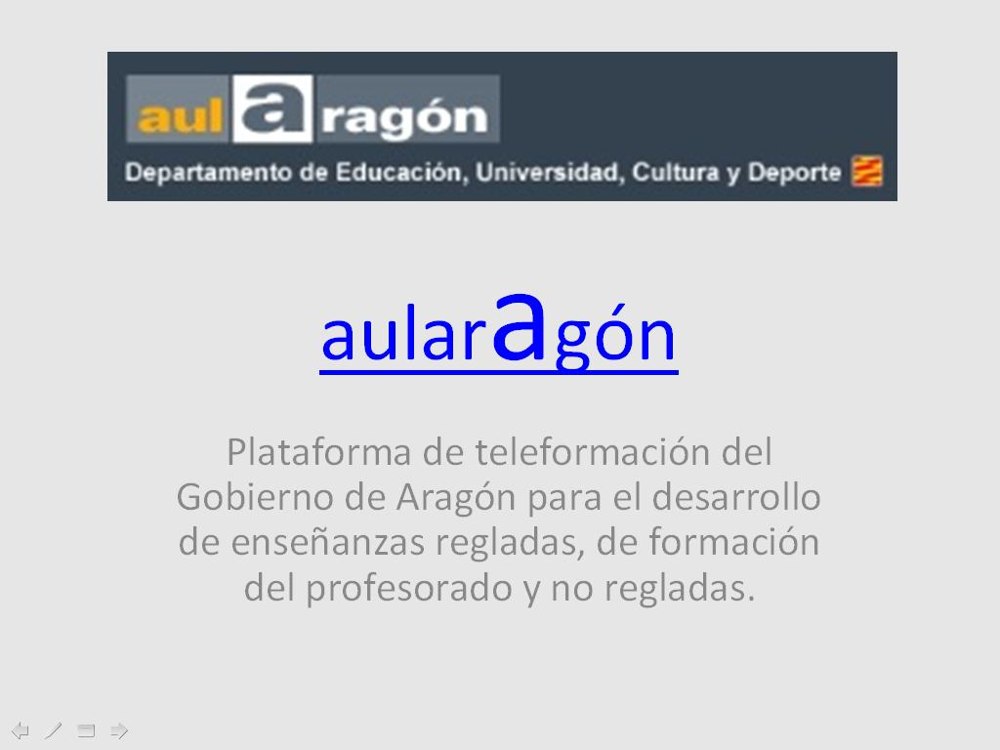

# Resumen

## Curiosidad 

En esta presentación encontrarás un resumen del módulo, haz clic sobre la imagen.

## Para saber más

Consulta el documento [matricula_enseñanzas_distancia_2012_13](6d6174726963756c615f656e7365c3b1616e7a61735f64697374616e6369615f323031325f3133.pdf) para hacerte una idea del volumen de matrículas en enseñanzas a distancia en Aragón.

Consulta los documentos de admisión, matriculación e instrucciones de principio de curso de las enseñanzas a distancia a través de aularagón para conocer los periodos y requisitos y las funciones del tutor de aula de autoaprendizaje.

En este enlace puedes descargar un archivo comprimido que contiene toda la información referida al curso 2013-14 sobre admisión y matrícula en las enseñanzas de regladas de aulAragón.

[Instrucciones inicio de curso](Instrucciones_inicio_curso_distancia.zip)
