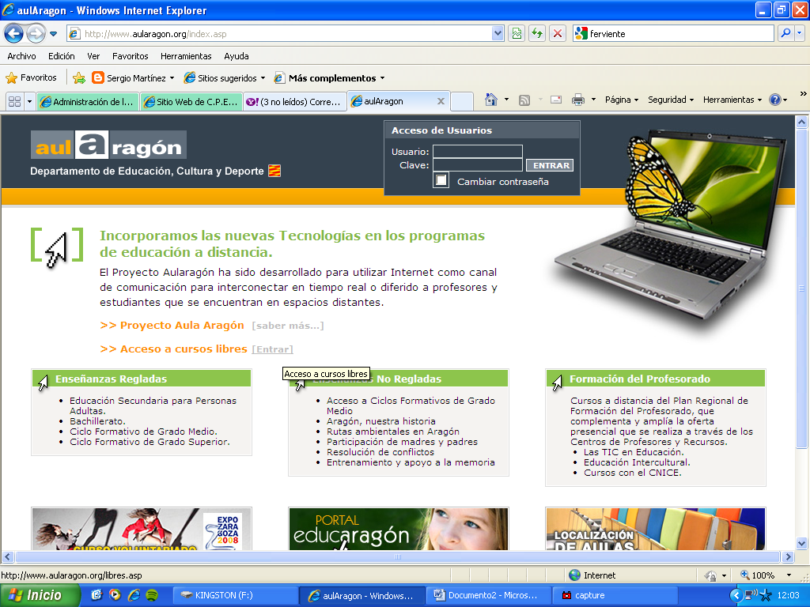
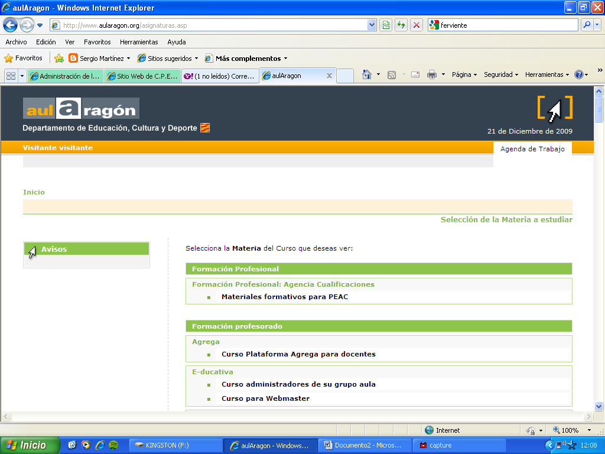
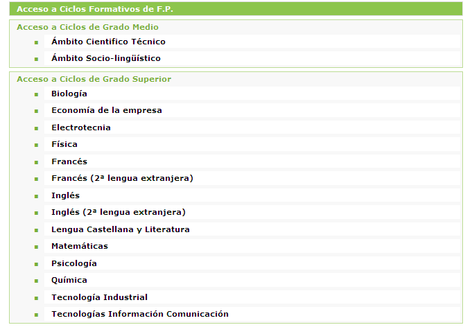
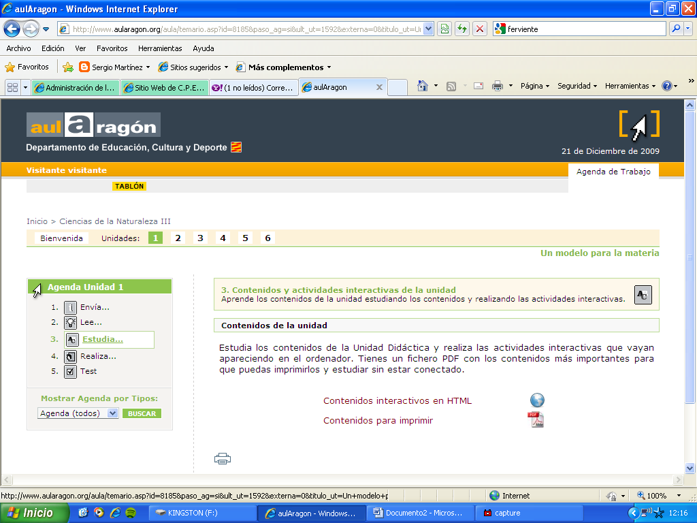
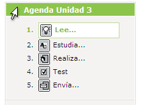
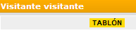

# Tarea exploratoria

## Tarea

**Entra en www.aularagon.org y realiza esta práctica para familiarizarte con esta plataforma. Recuerda acceder con usuario y contraseña **visitante **y anotar las fechas de entrega de actividades y examen del primer cuatrimestre.**

 

Para acceder al resto de enseñanzas es necesario haberse matriculado y cada administrador genera los usuarios y contraseñas, sin embargo, existe una clave general que empleamos frecuentemente para acceder a los materiales, incluso el alumnado que está en proceso de matriculación la emplea hasta que tiene sus claves propias. El usuario y clave genéricos son ****visitante.**** Entra en el aula introduciendo estos datos.

 

ADVERTENCIA: es posible que en ocasiones el usuario visitante haya sufrido el cambio de clave por algún usuario y hasta que no sea restaurada no funcionará.

Como puedes ver tenemos diferentes tipos de enseñanza, Formación del Profesorado, Formación Reglada y No Reglada, Cursos de Acceso a Formación Profesional...

Visita el aula de Naturaleza del bloque 3 de E.S.PA.d y busca las actividades obligatorias del primer envío, échales un vistazo. Ahora localiza los materiales de estudio de la unidad 1 tanto en PDF como HTML. A ambos, PDF y HTML, se accede desde cada unidad donde pone estudia. En E.S.P.A.d. el aula de Naturaleza del bloque 3 está bastante completa e interesante. Puedes acceder desde el aula a la versión HTML o desde este [enlace](http://www.aularagon.org/files/espa/espad/naturaleza/bloque3/Unidad_01/index.html).

Las secciones principales de las aulas son:

  Otra sección interesante es el **tablón**:

 

 

- **Localiza en esta sección "Tablón" los videos que hemos visionado sobre la mensajería y el uso de la plataforma.**
- **Encuentra las fechas de envío de actividades y examen correspondientes al primer cuatrimestre de este curso escolar.**
