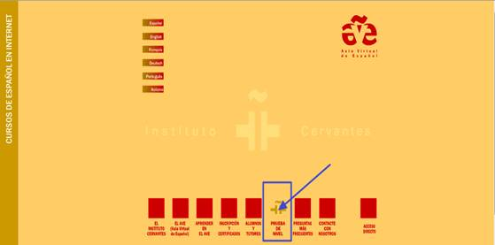
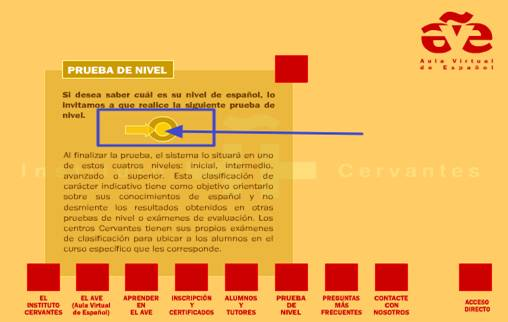

# Tarea exploratoria

## Tarea

Entra en [http://ave.cervantes.es/](http://ave.cervantes.es/) y pasa el ratón sobre los iconos que se encuentran en la parte inferior para que se activen y veas a donde nos conduce cada uno de ellos, pincha sobre **Prueba de Nivel.**

Alternativamente puedes acceder directamente desde [aquí](http://ave.cervantes.es/prueba_nivel/registro/test_de_clasificacion.php?origen=webAVE) o buscar en Google "prueba de nivel aula virtual de español instituto cervantes".

Ahora pincha en el botón para comenzar la prueba de nivel, esto te servirá para hacerte una idea del funcionamiento de la plataforma AVE, de hecho, es lo único que hacemos desde esta URL ya que el alumnado entra desde [ave2](http://www.ave2.cvc.cervantes.es/).

No es obligatorio que hagas toda la prueba completa ya que es larga pero sí deberás utilizarla para conocerla ya que es una prueba interesante para el nuevo alumnado AVE y es útil para familiarizarte con el entorno AVE.
