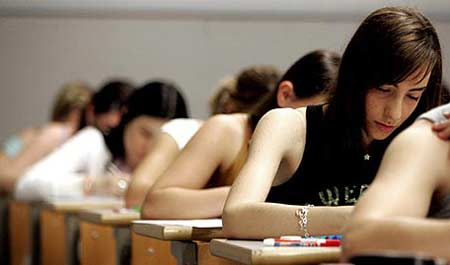

# U1. La ESPA

La Educación Secundaria para Personas Adultas permite a las personas adultas conseguir el título de Graduado en Educación Secundaria, la titulación básica en nuestro país. De ahí su importancia social y con seguridad la enseñanza más importante en los Centros Públicos de EPA.

