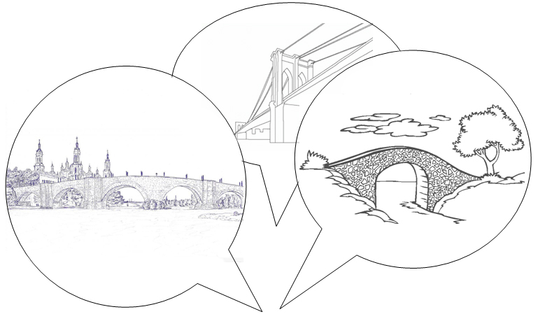

# U4. Construyendo puentes: los objetivos

## Importante

**Introducción**

En esta Unidad, se propone reflexionar sobre los objetivos de los cursos de enseñanza de español como nueva lengua. Para ello, es importante tener en cuenta tanto la mirada de la enseñanza de segundas lenguas como el marco de la Educación de Personas Adultas. Este marco es el que nos diferencia de otras entidades que también ofrecen la enseñanza del español y es el que dota de sentido global e integrador a la actuación.

**Evaluación**

Para superar esta Unidad, debes leer, en primer lugar, los contenidos, y, después, realizar una aportación en el foro, tal y como se indica en el apartado “Mensaje”.

## Objetivos

- Reflexionar sobre los objetivos que debe tener un curso de español como nueva lengua dentro del contexto de la EPA.
- Familiarizarse con instrumentos de ayuda a la programación dentro del marco de la enseñanza del español como segunda lengua.
- Conocer las orientaciones de Gobierno de Aragón para la programación de las enseñanzas de español en EPA.
- Proporcionar una bibliografía de utilidad para continuar la formación docente y planificar la intervención en el aula

## Actividad del foro

**Intervención reflexiva en el foro**

 

Tras leer los contenidos de esta Unidad, realiza una aportación en el foro debatiendo con tus compañeros sobre el siguiente tema:

 

**¿Cómo explicarías el título de esta Unidad?**

 **¿Qué simbolizan esos puentes?**

 **¿Qué objetivos son los que nos pueden permitir construirlos?**

 

 
